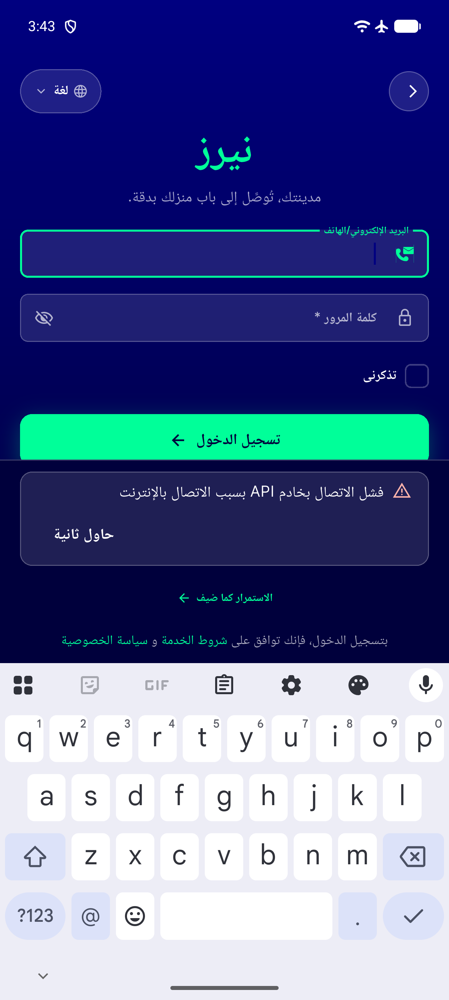

# QA Evidence — NEARS-2379

**PASS - noInternetMessage getter re-evaluates on locale switch (AC1/AC2 demonstrated live, AC3 confirmed by source)**

**1 screenshot(s).** Click any thumbnail for full resolution.

<table>
<tr>
<td align="center" width="33%"> ar guest login failure</td>
</tr>
</table>

---
*From `nears/docs/qa-evidence/NEARS-2379/` · public-repo scrub policy (no live secrets; verified clean).*
