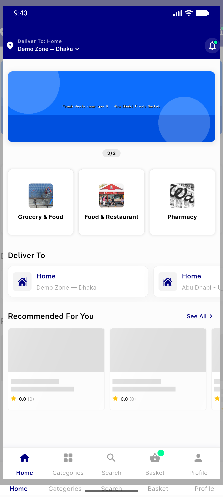
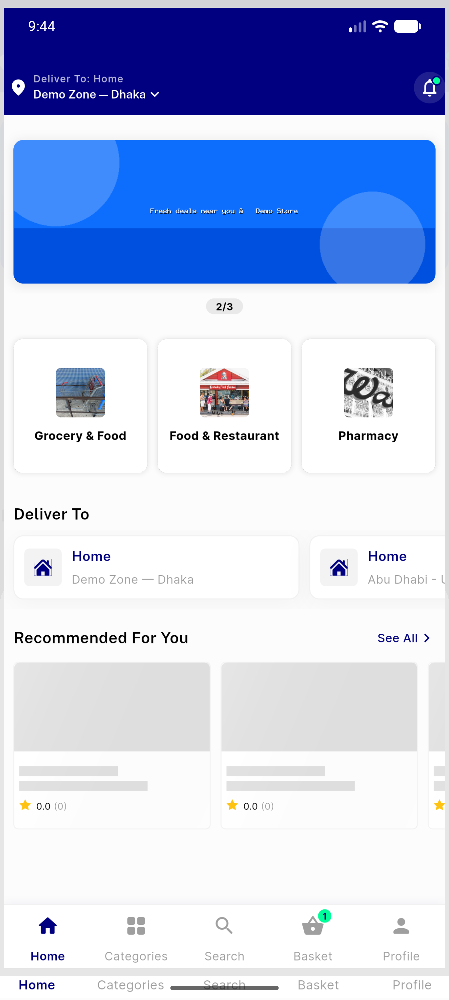
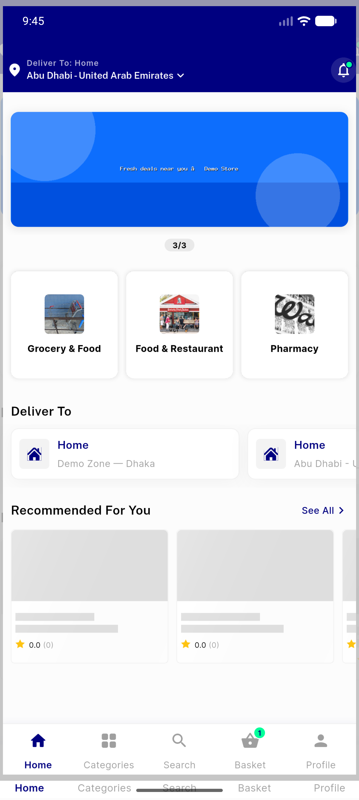
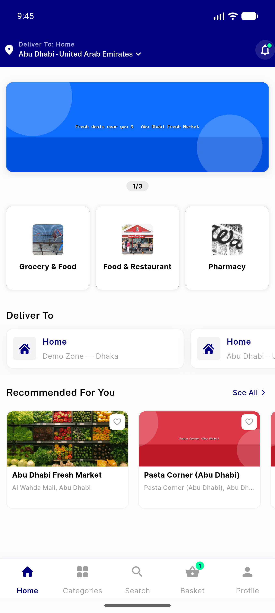
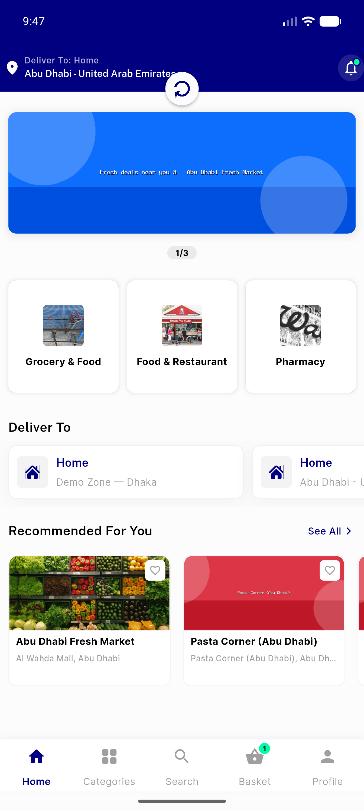

# QA Evidence — NEARS-238

**7 screenshot(s).** Click any thumbnail for full resolution.

<table>
<tr>
<td align="center" width="33%"> zone2 baseline</td>
<td align="center" width="33%"> skeleton during switch to zone1</td>
<td align="center" width="33%"> zone1 stores repainted</td>
</tr>
<tr>
<td align="center" width="33%"> skeleton during switch to zone2</td>
<td align="center" width="33%"> zone2 stores repainted</td>
<td align="center" width="33%"> cold launch no blank</td>
</tr>
<tr>
<td align="center" width="33%"> pull to refresh spinner</td>
</tr>
</table>

---
*From `nears/docs/qa-evidence/NEARS-238/` · public-repo scrub policy (no live secrets; verified clean).*
