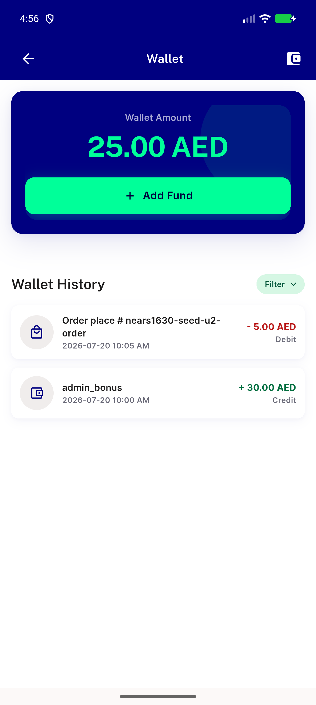
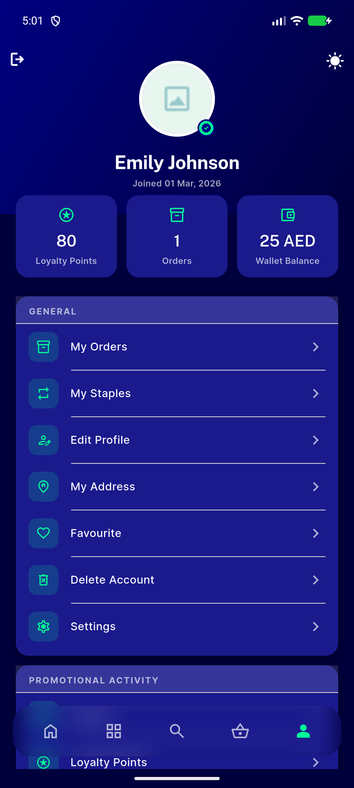
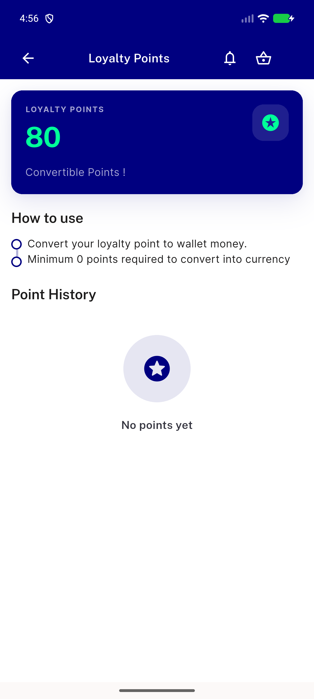
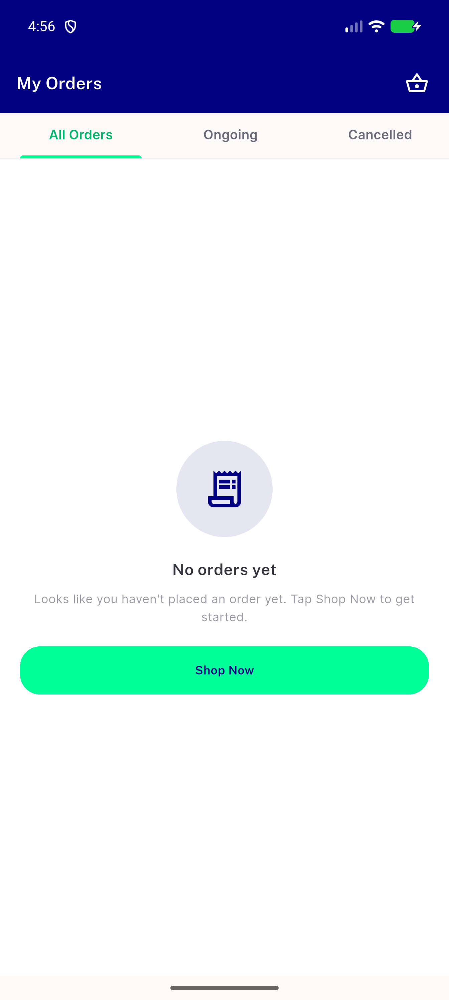
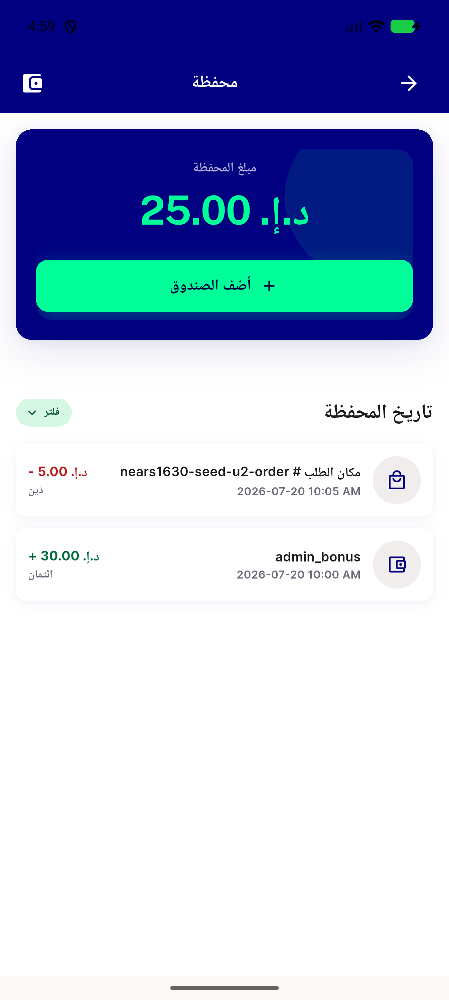

# QA Evidence — NEARS-2392

**PASS - wallet tile stale-config fix verified live, all 3 stat tiles clickable+navigate, RTL mirror confirmed, dark-mode quick-look clean**

**5 screenshot(s).** Click any thumbnail for full resolution.

<table>
<tr>
<td align="center" width="33%"> ac1 wallet tile navigates to wallet</td>
<td align="center" width="33%"> dark mode quicklook nonblocking</td>
<td align="center" width="33%"> loyalty tile navigates to loyalty</td>
</tr>
<tr>
<td align="center" width="33%"> orders tile navigates to orders</td>
<td align="center" width="33%"> rtl wallet tile navigates</td>
</tr>
</table>

### Other artifacts
- [`ac-rtl-menu-screen-stat-row-dump.xml`](ac-rtl-menu-screen-stat-row-dump.xml)
- [`ac2-menu-screen-stat-row-dump.xml`](ac2-menu-screen-stat-row-dump.xml)

---
*From `nears/docs/qa-evidence/NEARS-2392/` · public-repo scrub policy (no live secrets; verified clean).*
