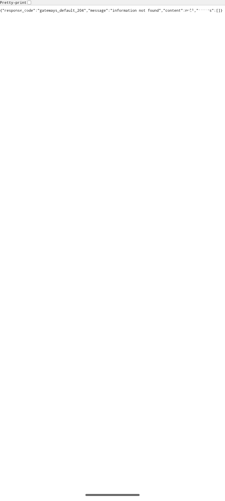

# QA Evidence — NEARS-2395

**PASS - DeliveryApp collect-cash payment route dispatch verified live on emulator-5562, AC1/AC2 re-confirmed via probe, AC3 live confirmed, 1 unrelated regression logged**

**1 screenshot(s).** Click any thumbnail for full resolution.

<table>
<tr>
<td align="center" width="33%"> ac3 paymentscreen webview</td>
</tr>
</table>

### Other artifacts
- [`bug-paymentscreen-popscope-debuglocked.log`](bug-paymentscreen-popscope-debuglocked.log)

---
*From `nears/docs/qa-evidence/NEARS-2395/` · public-repo scrub policy (no live secrets; verified clean).*
