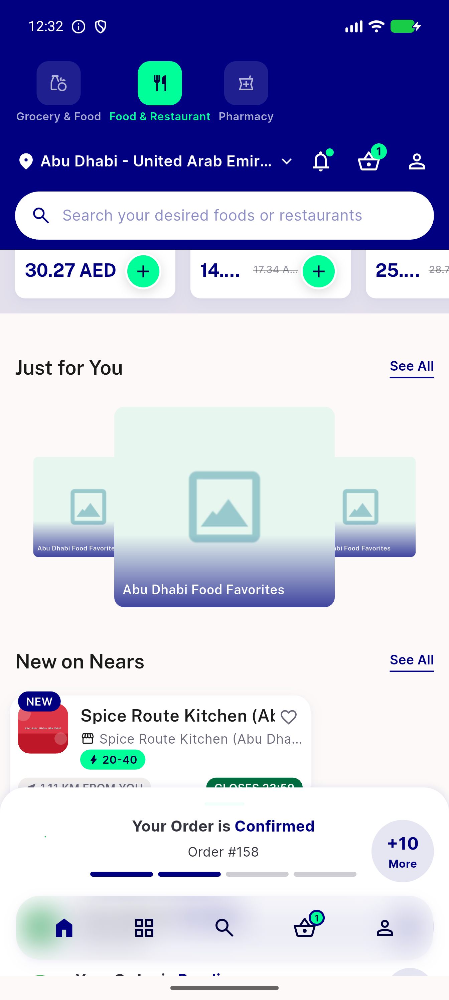
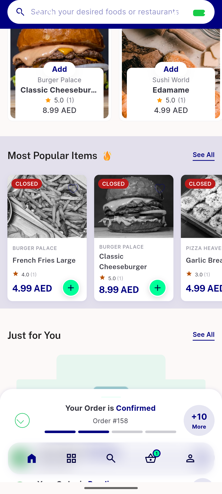

# QA Evidence — NEARS-2399

**PASS - Zone-2 Food Just for You + New on Nears rails populated from new item_campaigns row (store 49 Spice Route Kitchen); zone-1 unaffected; 1 pre-existing unrelated crash found (item detail bottom sheet null-check on choice_options, affects ALL item_campaigns rows incl pre-existing zone-1 fixtures) filed as regression_bug**

**3 screenshot(s).** Click any thumbnail for full resolution.

<table>
<tr>
<td align="center" width="33%"> ac1 ac2 zone2 food just for you new on nears</td>
<td align="center" width="33%"> ac3 zone1 food just for you new on nears unaffected</td>
<td align="center" width="33%"> bug campaign item choiceoptions nullcheck crash</td>
</tr>
</table>

### Other artifacts
- [`bug-campaign-item-choiceoptions-nullcheck-crash.log`](bug-campaign-item-choiceoptions-nullcheck-crash.log)

---
*From `nears/docs/qa-evidence/NEARS-2399/` · public-repo scrub policy (no live secrets; verified clean).*
