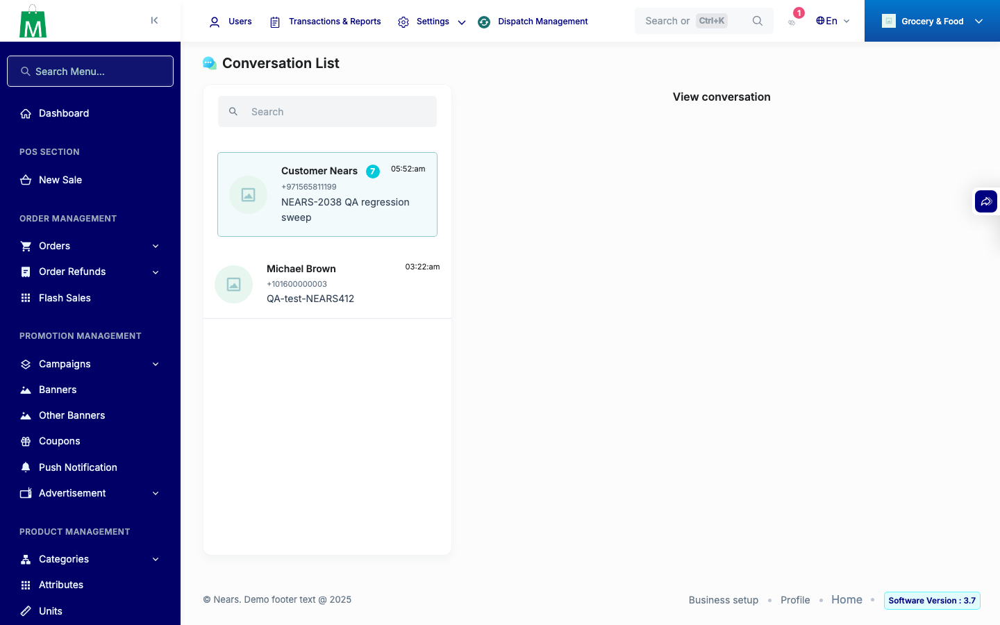

# QA Evidence — NEARS-2402

**BLOCKED — API ACs (AC1/AC1b/AC2/AC3) + regression all PASS live; AC4/AC4b (UI) undemonstrated: Android device pool fully saturated by concurrent sessions, iOS blocked by pre-existing unrelated Podfile.lock/FirebaseAnalytics version mismatch**

**1 screenshot(s).** Click any thumbnail for full resolution.

<table>
<tr>
<td align="center" width="33%"> admin message list</td>
</tr>
</table>

### Other artifacts
- [`ac1-customer-message-details-conv60.json`](ac1-customer-message-details-conv60.json)
- [`ac1b-dm-message-details-conv60.json`](ac1b-dm-message-details-conv60.json)
- [`ac1b-dm-message-send.json`](ac1b-dm-message-send.json)
- [`ac2-vendor-message-details-conv46.json`](ac2-vendor-message-details-conv46.json)
- [`ac2-vendor-message-list.json`](ac2-vendor-message-list.json)
- [`ac2-vendor-message-search-list.json`](ac2-vendor-message-search-list.json)
- [`ac2-vendor-message-send-conv46.json`](ac2-vendor-message-send-conv46.json)
- [`ac3-nested-vendor-store-strip-conv46.json`](ac3-nested-vendor-store-strip-conv46.json)
- [`automated-phpunit-nears2402.log`](automated-phpunit-nears2402.log)
- [`bug-admin-blade-nulldef-deliveryman-view.log`](bug-admin-blade-nulldef-deliveryman-view.log)

---
*From `nears/docs/qa-evidence/NEARS-2402/` · public-repo scrub policy (no live secrets; verified clean).*
