# QA Evidence — NEARS-2404

**QA PASS — AC1 (RTL no overflow) + AC2 (no RenderFlex error) verified live on emulator-5558, English+Arabic sanity clean, custom-tip-field regression clean. Informational: NEARS-2629 font-scale>=1.0 overflow (7px LTR/11px RTL) confirmed still present, non-blocking per scope.**

**12 screenshot(s).** Click any thumbnail for full resolution.

<table>
<tr>
<td align="center" width="33%"><a href="checkout-ar-tips-custom.png">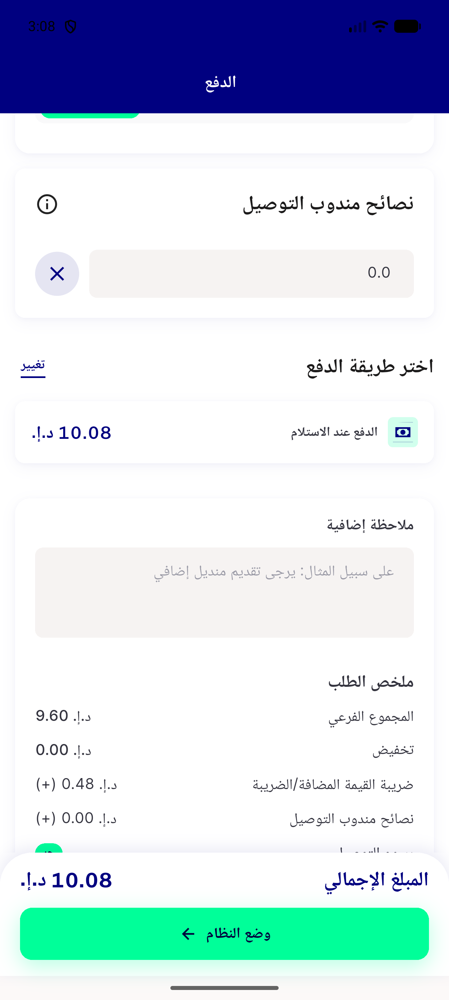</a> checkout ar tips custom</td>
<td align="center" width="33%"><a href="checkout-ar-tips-fontscale.png">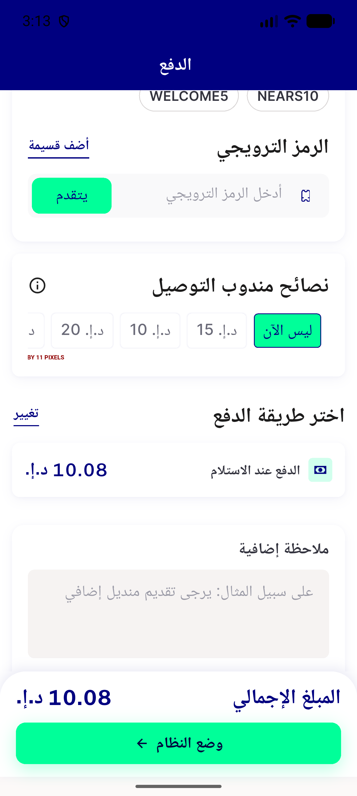</a> checkout ar tips fontscale</td>
<td align="center" width="33%"><a href="checkout-ar-tips.png">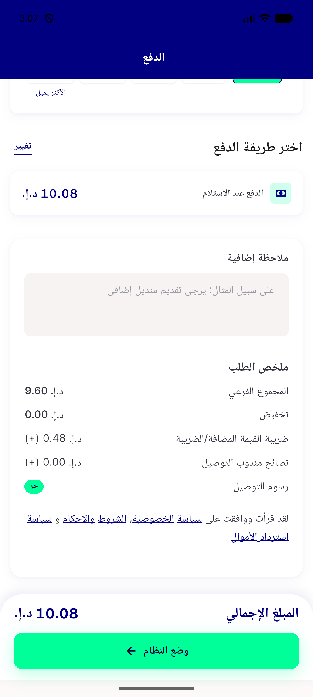</a> checkout ar tips</td>
</tr>
<tr>
<td align="center" width="33%"><a href="checkout-ar-tips2.png">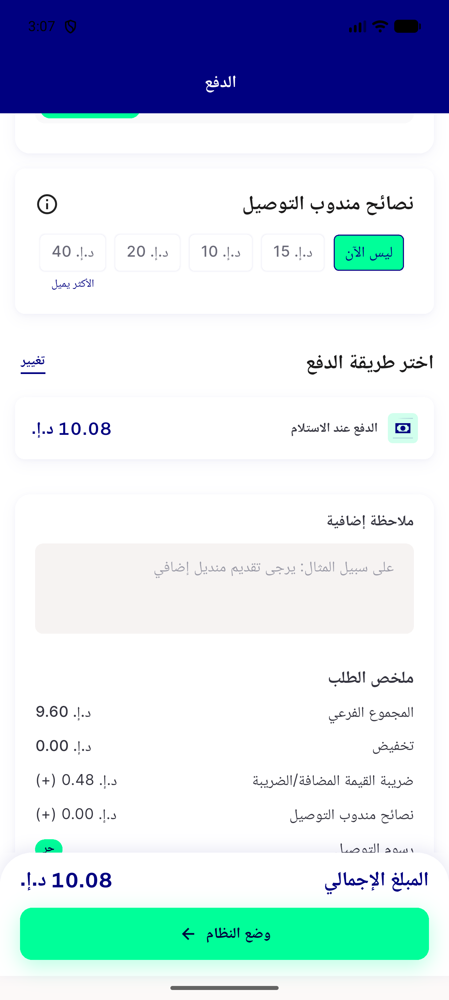</a> checkout ar tips2</td>
<td align="center" width="33%"><a href="checkout-en-tips-fontscale.png">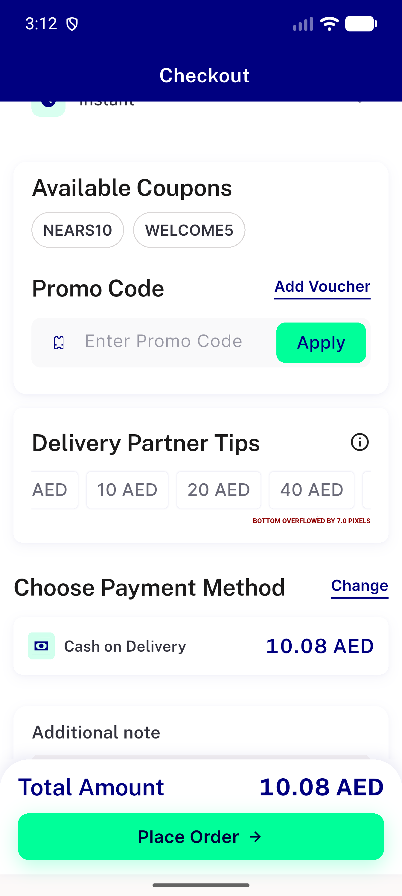</a> checkout en tips fontscale</td>
<td align="center" width="33%"><a href="checkout-en-tips-full.png">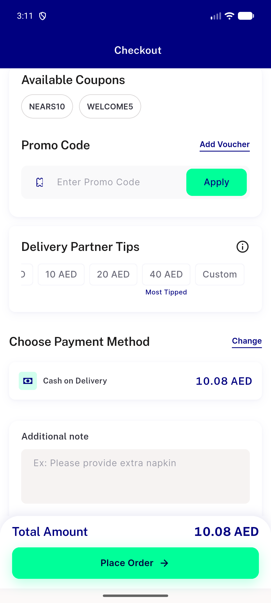</a> checkout en tips full</td>
</tr>
<tr>
<td align="center" width="33%"><a href="checkout-en-tips.png">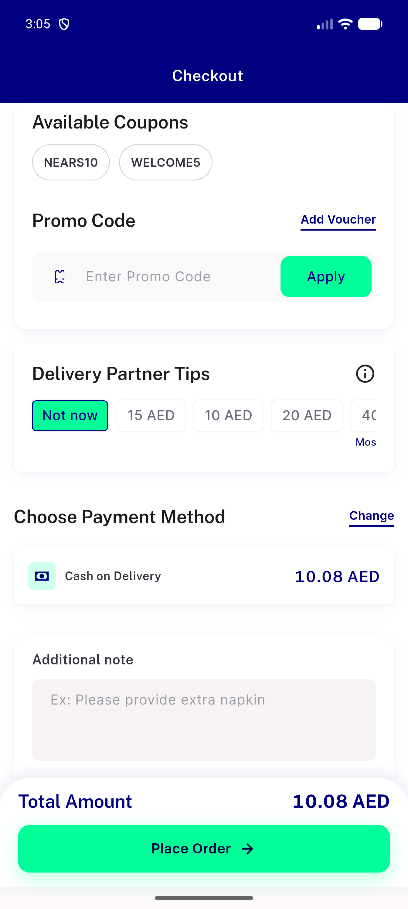</a> checkout en tips</td>
<td align="center" width="33%"><a href="checkout-en-top.png">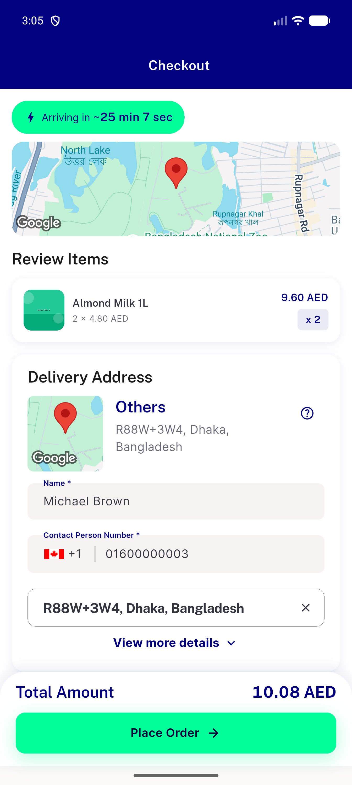</a> checkout en top</td>
<td align="center" width="33%"><a href="debug-basket.png">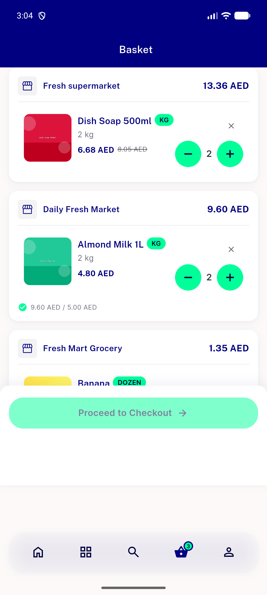</a> debug basket</td>
</tr>
<tr>
<td align="center" width="33%"><a href="debug-basket2.png">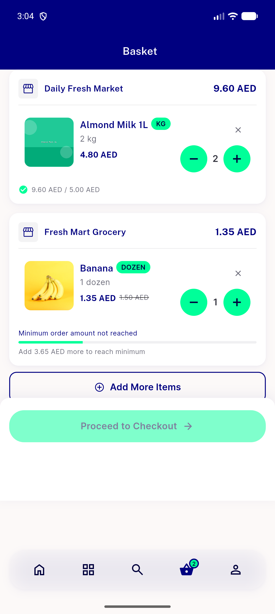</a> debug basket2</td>
<td align="center" width="33%"> debug basket3</td>
<td align="center" width="33%"><a href="debug-basket4.png">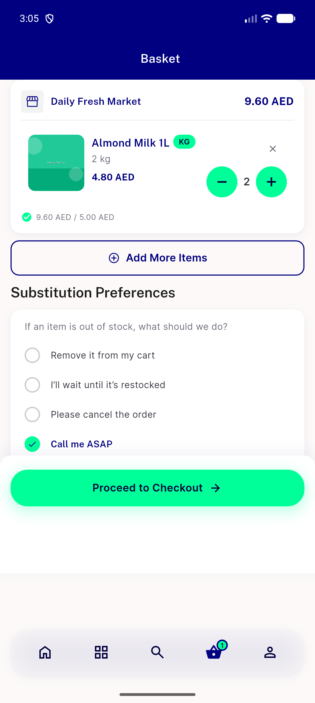</a> debug basket4</td>
</tr>
</table>

---
*From `nears/docs/qa-evidence/NEARS-2404/` · public-repo scrub policy (no live secrets; verified clean).*
