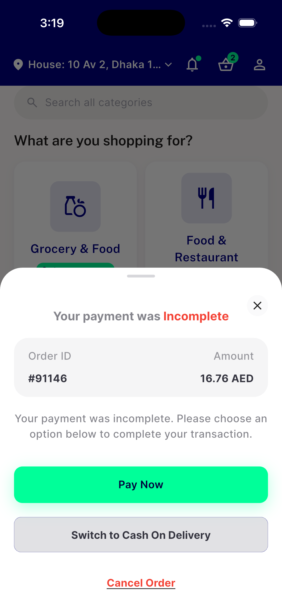
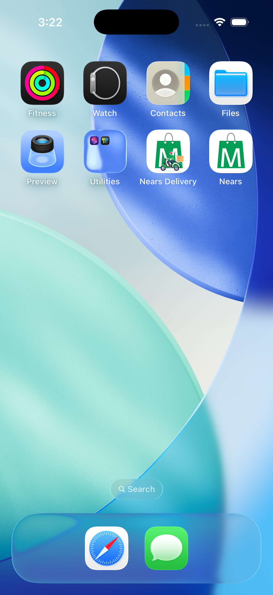

# QA Evidence — NEARS-2405

**PASS (AC1/AC3 live-confirmed, AC2 environment-blocked — device tooling structurally cannot tap a SpringBoard notification banner while the app is killed, reported per the ticket's own out-clause)**

**3 screenshot(s).** Click any thumbnail for full resolution.

<table>
<tr>
<td align="center" width="33%"> ac1 run1 coldboot</td>
<td align="center" width="33%"> ac1 run4 postpush coldboot</td>
<td align="center" width="33%"> ac2 push sent screen</td>
</tr>
</table>

### Other artifacts
- [`ac1-ac3-run1-log-excerpt.log`](ac1-ac3-run1-log-excerpt.log)
- [`ac1-ac3-run2-log-excerpt.log`](ac1-ac3-run2-log-excerpt.log)
- [`ac1-ac3-run3-log-excerpt.log`](ac1-ac3-run3-log-excerpt.log)
- [`ac1-run4-postpush-log-excerpt.log`](ac1-run4-postpush-log-excerpt.log)
- [`ac2-ax-probe-no-labeled-banner.log`](ac2-ax-probe-no-labeled-banner.log)
- [`ac2-springboard-push-delivery.log`](ac2-springboard-push-delivery.log)
- [`bug-pre-existing-flutter-test-failures-summary.log`](bug-pre-existing-flutter-test-failures-summary.log)

---
*From `nears/docs/qa-evidence/NEARS-2405/` · public-repo scrub policy (no live secrets; verified clean).*
