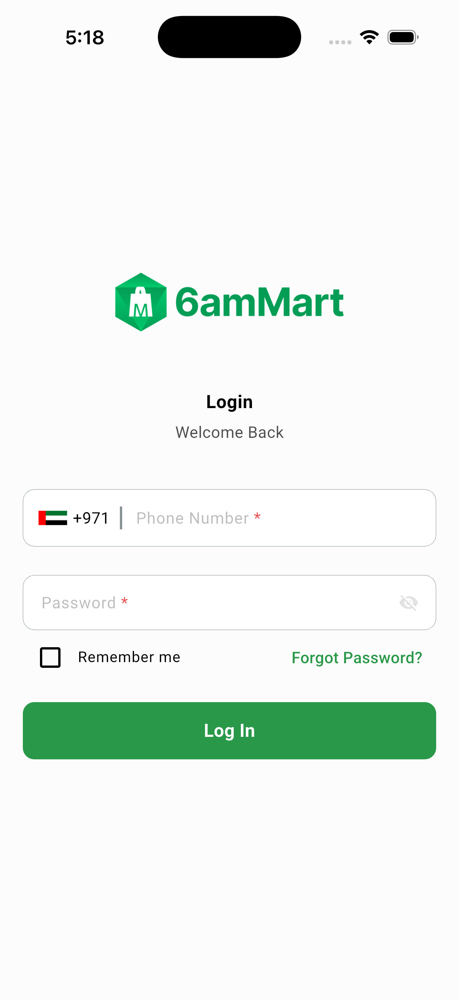
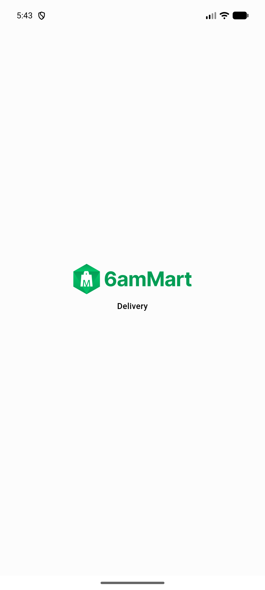
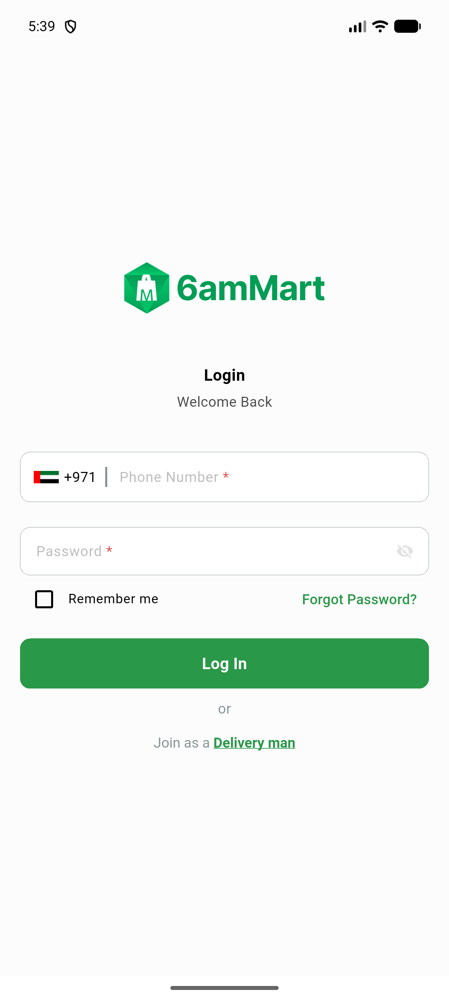

# QA Evidence — NEARS-2409

**PASS - iOS+Android live race repro confirmed, fix holds, 0 configModel! force-unwraps remain**

**4 screenshot(s).** Click any thumbnail for full resolution.

<table>
<tr>
<td align="center" width="33%"> ac1 ios race repro1 fixed signin</td>
<td align="center" width="33%"> ac1 ios race repro2 fixed signin freshprocess</td>
<td align="center" width="33%"> ac3 android normal path dmbutton</td>
</tr>
<tr>
<td align="center" width="33%"> prefix android attempt no crash tight timing</td>
</tr>
</table>

### Other artifacts
- [`ac1-ios-repro1-race-order.log`](ac1-ios-repro1-race-order.log)
- [`ac3-android-repro1-race-order.log`](ac3-android-repro1-race-order.log)
- [`ac3-android-repro2-race-order.log`](ac3-android-repro2-race-order.log)
- [`bug-ios-clearshareddata-apns-throw-leaves-token-cached.log`](bug-ios-clearshareddata-apns-throw-leaves-token-cached.log)

---
*From `nears/docs/qa-evidence/NEARS-2409/` · public-repo scrub policy (no live secrets; verified clean).*
