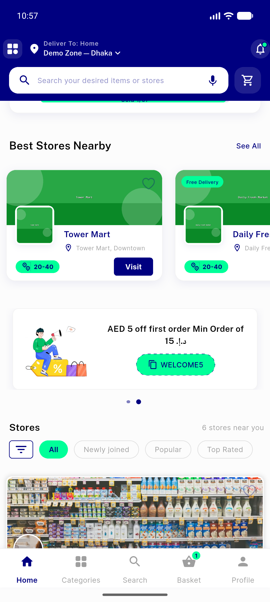
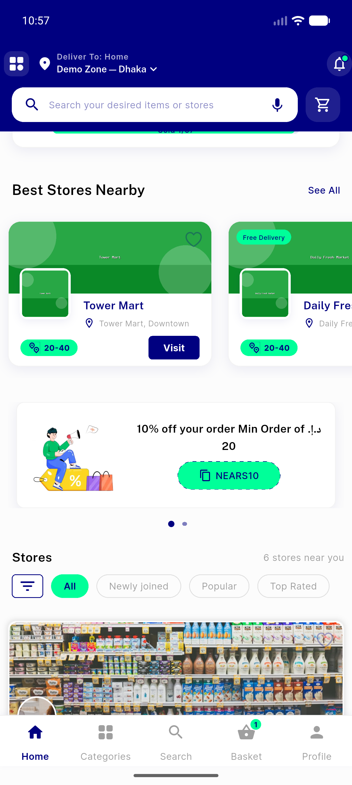
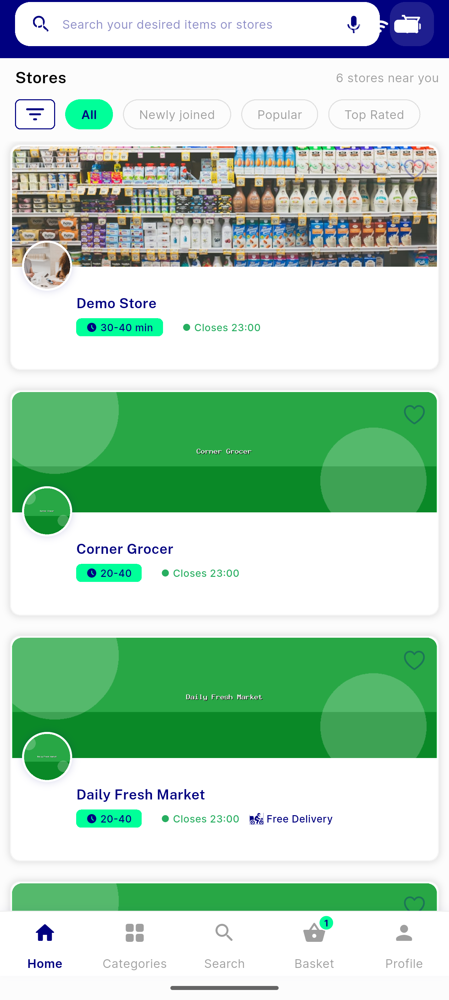

# QA Evidence — NEARS-241

**3 screenshot(s).** Click any thumbnail for full resolution.

<table>
<tr>
<td align="center" width="33%"> carousel card swipe</td>
<td align="center" width="33%"> popular store carousel no overflow</td>
<td align="center" width="33%"> store cards with without freedelivery</td>
</tr>
</table>

---
*From `nears/docs/qa-evidence/NEARS-241/` · public-repo scrub policy (no live secrets; verified clean).*
