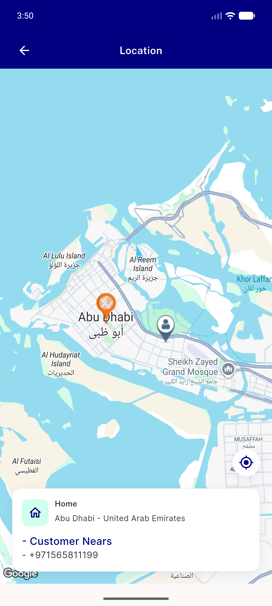
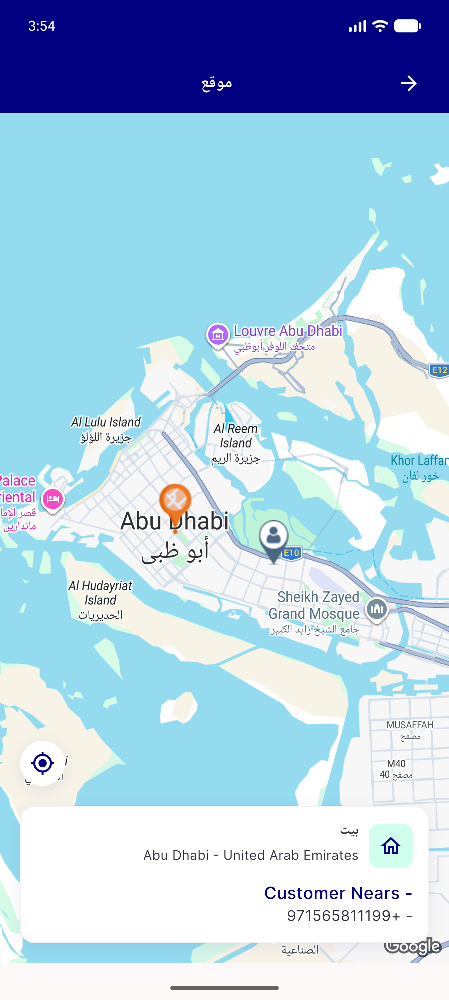

# QA Evidence — NEARS-2411

**PASS — map_screen.dart use-current-location control mirrors correctly LTR->RTL (AlignmentDirectional.centerEnd)**

**2 screenshot(s).** Click any thumbnail for full resolution.

<table>
<tr>
<td align="center" width="33%"> ac2 ltr map screen</td>
<td align="center" width="33%"> ac2 rtl map screen</td>
</tr>
</table>

---
*From `nears/docs/qa-evidence/NEARS-2411/` · public-repo scrub policy (no live secrets; verified clean).*
