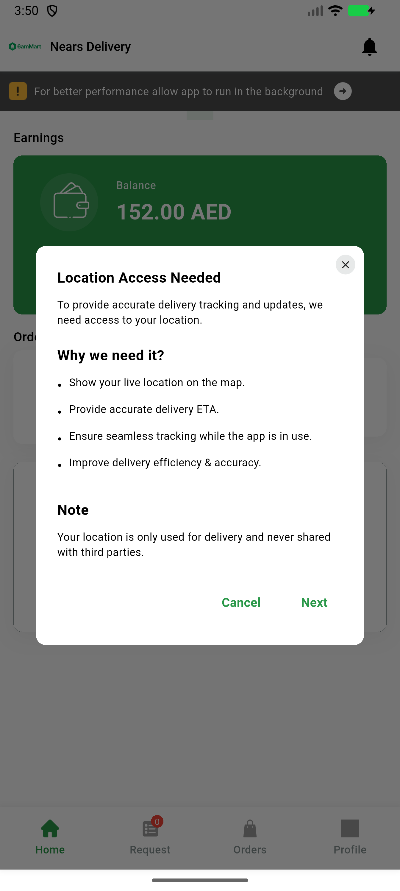
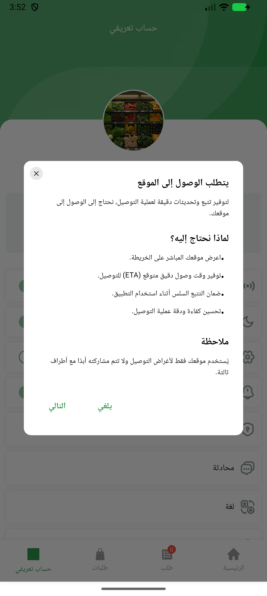

# QA Evidence — NEARS-2412

**PASS - close-X PositionedDirectional RTL mirroring verified live on DeliveryApp (emulator-5564)**

**2 screenshot(s).** Click any thumbnail for full resolution.

<table>
<tr>
<td align="center" width="33%"> ltr dialog</td>
<td align="center" width="33%"> rtl dialog</td>
</tr>
</table>

---
*From `nears/docs/qa-evidence/NEARS-2412/` · public-repo scrub policy (no live secrets; verified clean).*
