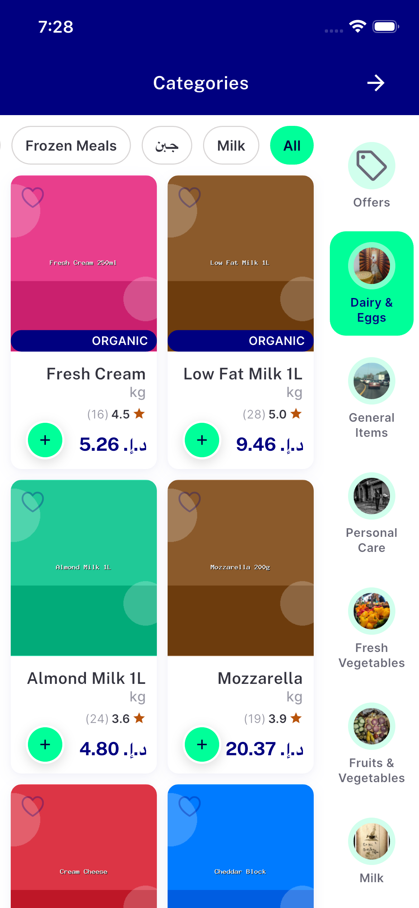

# QA Evidence — NEARS-2413

**PASS - category grid mainAxisExtent fix verified live on iOS (Android pool exhausted); real production data revealed a pre-existing, non-blocking NBadge squeeze inherited from store_screen.dart**

**1 screenshot(s).** Click any thumbnail for full resolution.

<table>
<tr>
<td align="center" width="33%"> ac1 ac2 category grid ios</td>
</tr>
</table>

### Other artifacts
- [`ac3-textscale-1.3x-confirmation.log`](ac3-textscale-1.3x-confirmation.log)
- [`bug-nbadge-new-badge-name-squeeze.log`](bug-nbadge-new-badge-name-squeeze.log)

---
*From `nears/docs/qa-evidence/NEARS-2413/` · public-repo scrub policy (no live secrets; verified clean).*
