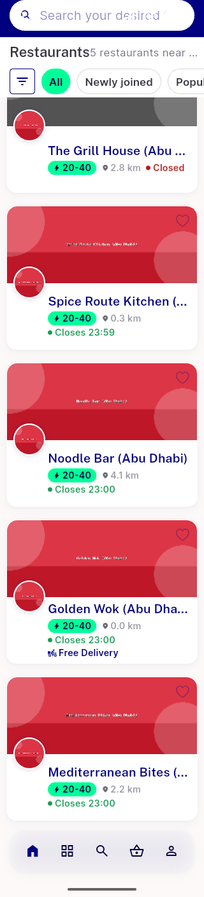
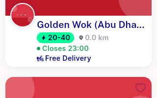

# QA Evidence — NEARS-2414

**PASS fix-cycle2 - Free Delivery chip fixed at 320dp/1.3x LTR, RTL and 100pct clean**

**9 screenshot(s).** Click any thumbnail for full resolution.

<table>
<tr>
<td align="center" width="33%"> ac1 320dp 13x ltr fullscreen</td>
<td align="center" width="33%"> ac1 320dp 13x rtl goldenwok ok</td>
<td align="center" width="33%"> ac1 fix2 320dp 13x ltr goldenwok</td>
</tr>
<tr>
<td align="center" width="33%"> ac1 fix2 320dp 13x rtl goldenwok</td>
<td align="center" width="33%"> ac1 fix2 goldenwok crop</td>
<td align="center" width="33%"> ac1 fix2 rtl goldenwok crop</td>
</tr>
<tr>
<td align="center" width="33%"> ac2 100pct baseline</td>
<td align="center" width="33%"> ac2 fix2 320dp 100pct goldenwok</td>
<td align="center" width="33%"> bug freedelivery chip clipped 320dp 13x ltr</td>
</tr>
</table>

### Other artifacts
- [`ac1-320dp-13x-rtl-a11ydump.xml`](ac1-320dp-13x-rtl-a11ydump.xml)
- [`ac1-fix2-320dp-13x-ltr-a11ydump.xml`](ac1-fix2-320dp-13x-ltr-a11ydump.xml)
- [`ac1-fix2-320dp-13x-rtl-a11ydump.xml`](ac1-fix2-320dp-13x-rtl-a11ydump.xml)
- [`ac2-fix2-320dp-100pct-a11ydump.xml`](ac2-fix2-320dp-100pct-a11ydump.xml)
- [`bug-freedelivery-chip-clipped-320dp-13x-ltr-a11ydump.xml`](bug-freedelivery-chip-clipped-320dp-13x-ltr-a11ydump.xml)
- [`bug-transient-overflow-locale-scale-transition.log`](bug-transient-overflow-locale-scale-transition.log)

---
*From `nears/docs/qa-evidence/NEARS-2414/` · public-repo scrub policy (no live secrets; verified clean).*
