# QA Evidence — NEARS-2415

**PASS — chat 3-image grid cross-axis order fix verified live (Android emulator-5564): outgoing+incoming, EN/LTR+Arabic/RTL, 3/1/2/5-image cases, 3x cold restart, all pixel+tap confirmed; automated backstop 266/266 pass; logs clean**

**17 screenshot(s).** Click any thumbnail for full resolution.

<table>
<tr>
<td align="center" width="33%"><a href="ac1-outgoing-ltr-grid-order.png">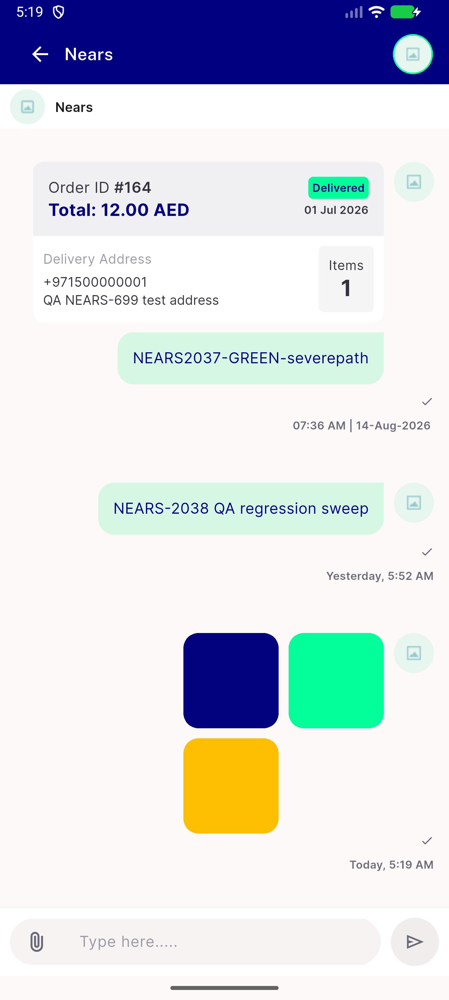</a> ac1 outgoing ltr grid order</td>
<td align="center" width="33%"><a href="ac2-tap-pos0-opens-navy.png">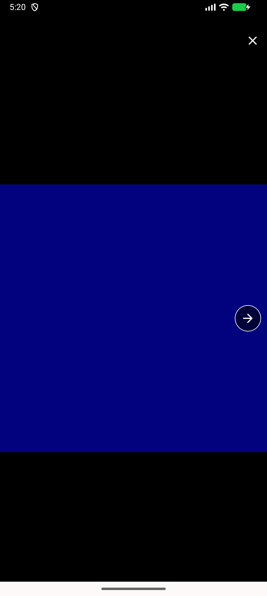</a> ac2 tap pos0 opens navy</td>
<td align="center" width="33%"><a href="ac2-tap-pos1-opens-mint.png">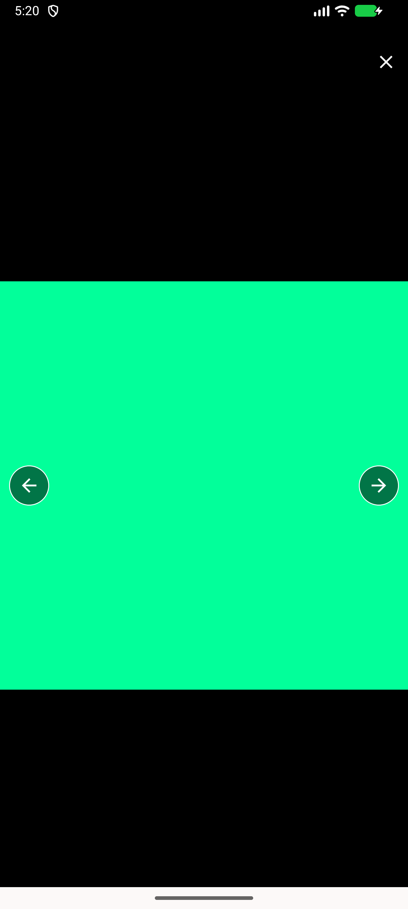</a> ac2 tap pos1 opens mint</td>
</tr>
<tr>
<td align="center" width="33%"><a href="ac3-tap-pos2-opens-amber.png">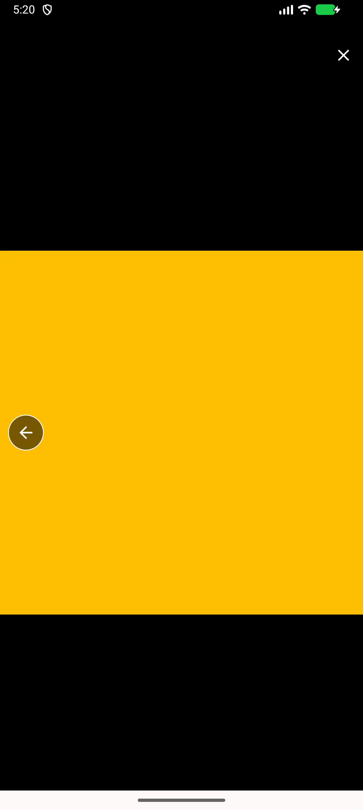</a> ac3 tap pos2 opens amber</td>
<td align="center" width="33%"> ac4 post 3x cold restart grid order</td>
<td align="center" width="33%"><a href="overlay-tap-arabic-opens-cyan-idx3.png">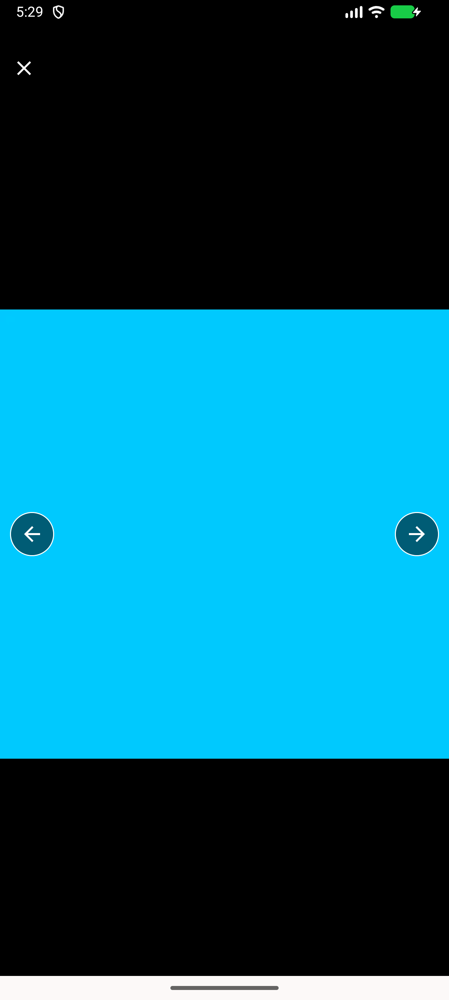</a> overlay tap arabic opens cyan idx3</td>
</tr>
<tr>
<td align="center" width="33%"><a href="overlay-tap-en-opens-cyan-idx3.png">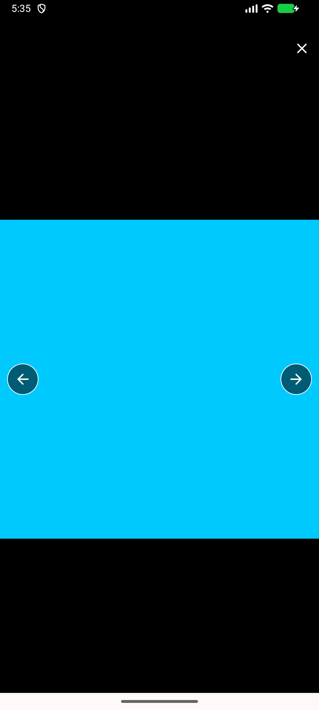</a> overlay tap en opens cyan idx3</td>
<td align="center" width="33%"><a href="regression-1image-message.png">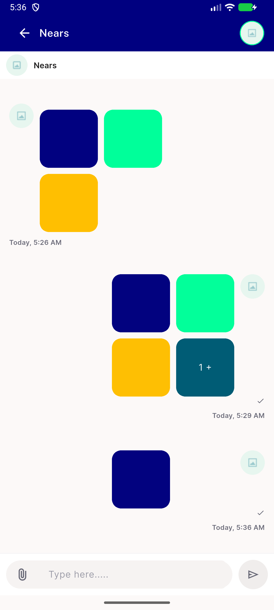</a> regression 1image message</td>
<td align="center" width="33%"><a href="regression-2image-message.png">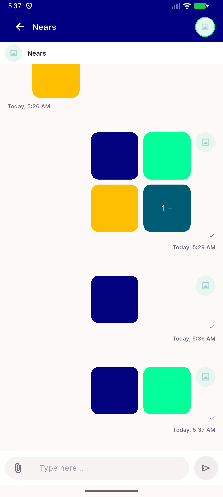</a> regression 2image message</td>
</tr>
<tr>
<td align="center" width="33%"><a href="regression-incoming-en-and-5img-overlay.png">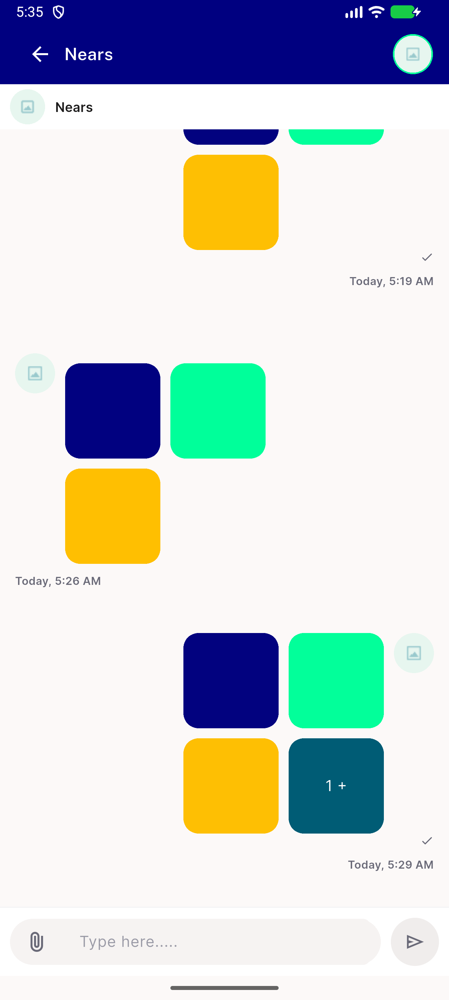</a> regression incoming en and 5img overlay</td>
<td align="center" width="33%"><a href="regression-outgoing-3img-en-post-locale-roundtrip.png">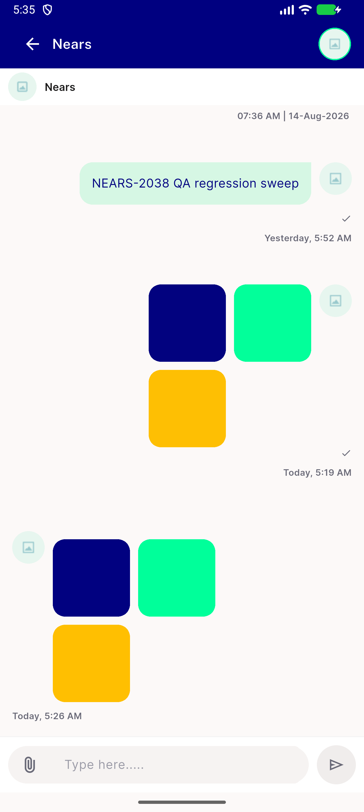</a> regression outgoing 3img en post locale roundtrip</td>
<td align="center" width="33%"><a href="rtl-incoming-grid-stays-ltr.png">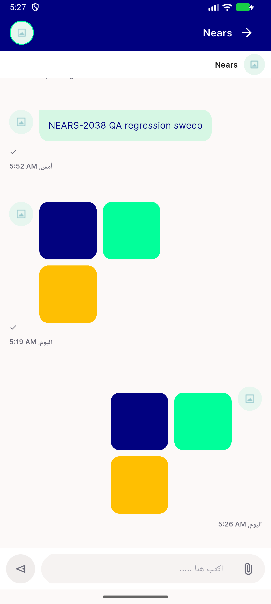</a> rtl incoming grid stays ltr</td>
</tr>
<tr>
<td align="center" width="33%"> rtl incoming tap left opens navy</td>
<td align="center" width="33%"> rtl incoming tap right opens mint</td>
<td align="center" width="33%"><a href="rtl-outgoing-grid-stays-ltr.png">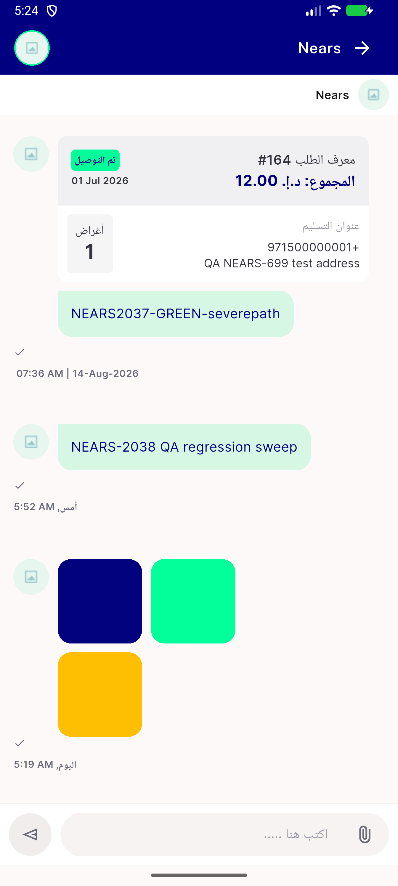</a> rtl outgoing grid stays ltr</td>
</tr>
<tr>
<td align="center" width="33%"><a href="rtl-outgoing-tap-left-opens-navy.png">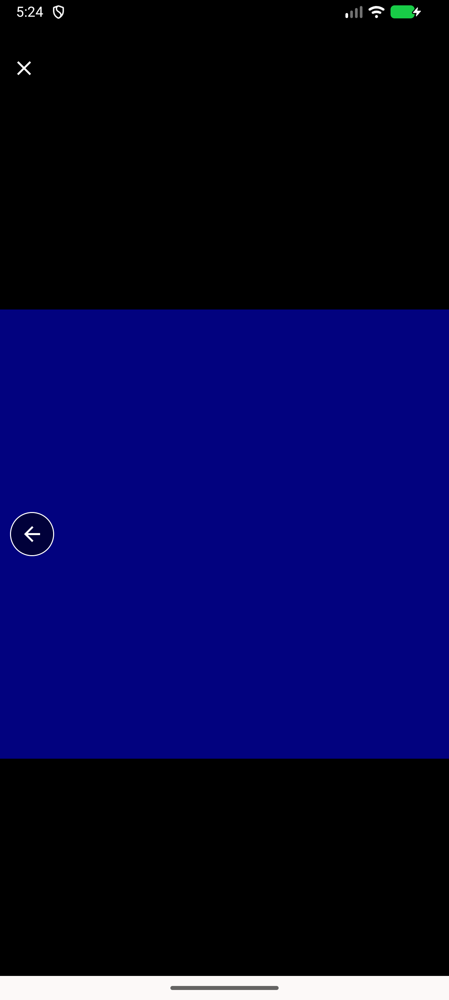</a> rtl outgoing tap left opens navy</td>
<td align="center" width="33%"><a href="rtl-outgoing-tap-right-opens-mint.png">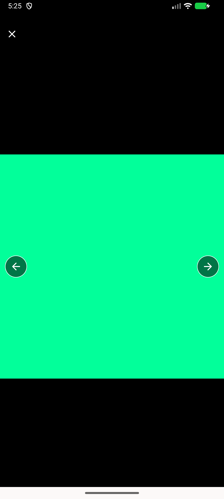</a> rtl outgoing tap right opens mint</td>
</tr>
</table>

---
*From `nears/docs/qa-evidence/NEARS-2415/` · public-repo scrub policy (no live secrets; verified clean).*
