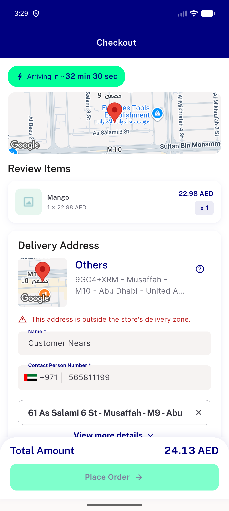

# QA Evidence — NEARS-2423

**PASS - delta QA fix-cycle 1: AC1 + AC2 demonstrated live on device; group-checkout path exercised (no crash); regression finding: dead resetGroupFees() latch (pre-existing, unrelated)**

**1 screenshot(s).** Click any thumbnail for full resolution.

<table>
<tr>
<td align="center" width="33%"> ac1 outofzone walkable route checkout</td>
</tr>
</table>

### Other artifacts
- [`ac1-clean-distance-parse.log`](ac1-clean-distance-parse.log)
- [`ac2-fallback-logged.log`](ac2-fallback-logged.log)
- [`bug-group-fee-latch-never-resets.log`](bug-group-fee-latch-never-resets.log)
- [`curl-ac1-route-exists.json`](curl-ac1-route-exists.json)
- [`curl-ac2-route-not-found.json`](curl-ac2-route-not-found.json)
- [`curl-inzone-happy-path.json`](curl-inzone-happy-path.json)
- [`flutter-test-output.log`](flutter-test-output.log)
- [`flutter-test-rerun-fixcycle1.log`](flutter-test-rerun-fixcycle1.log)
- [`laravel-log-warning-excerpt.log`](laravel-log-warning-excerpt.log)
- [`phpunit-output.log`](phpunit-output.log)
- [`phpunit-rerun-fixcycle1.log`](phpunit-rerun-fixcycle1.log)

---
*From `nears/docs/qa-evidence/NEARS-2423/` · public-repo scrub policy (no live secrets; verified clean).*
