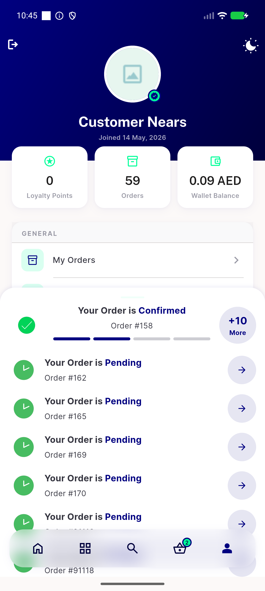
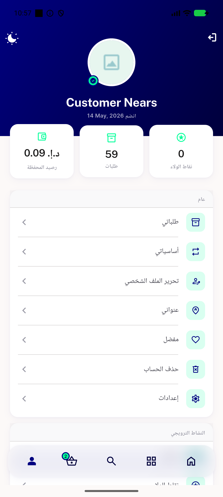

# QA Evidence — NEARS-2424

**PASS - floating navbar hit-test fix verified live, AC1/AC2/AC3 + RTL + regression sweep clean**

**4 screenshot(s).** Click any thumbnail for full resolution.

<table>
<tr>
<td align="center" width="33%"> ac1 home passthrough before tap</td>
<td align="center" width="33%"> ac1 menu loyalty under bar</td>
<td align="center" width="33%"> ac2 menu maxscroll logout clearance</td>
</tr>
<tr>
<td align="center" width="33%"> rtl nav mirrored</td>
</tr>
</table>

### Other artifacts
- [`ac3-accessibility-dump.xml`](ac3-accessibility-dump.xml)

---
*From `nears/docs/qa-evidence/NEARS-2424/` · public-repo scrub policy (no live secrets; verified clean).*
