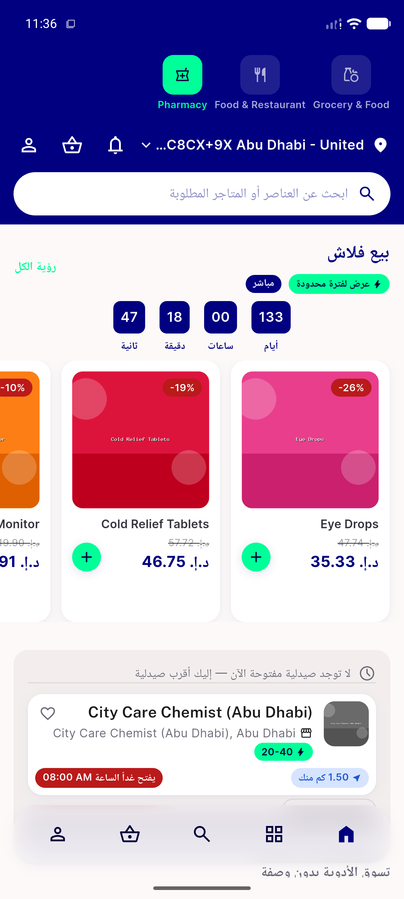
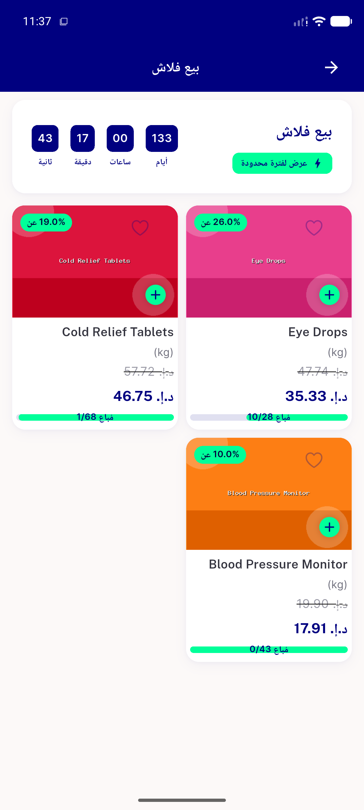
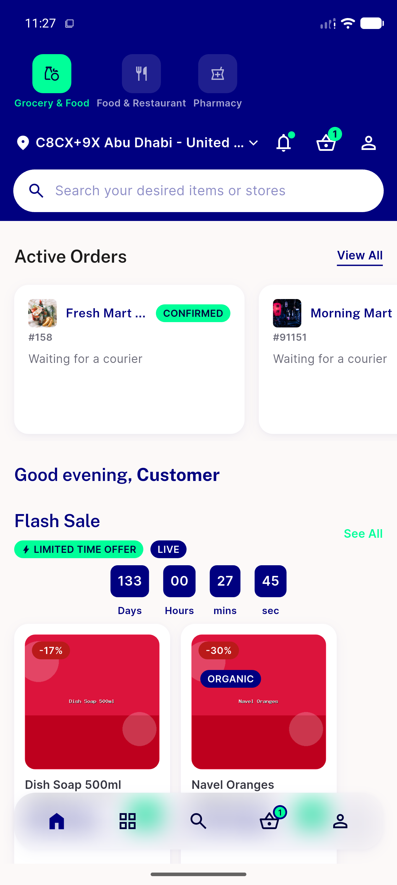
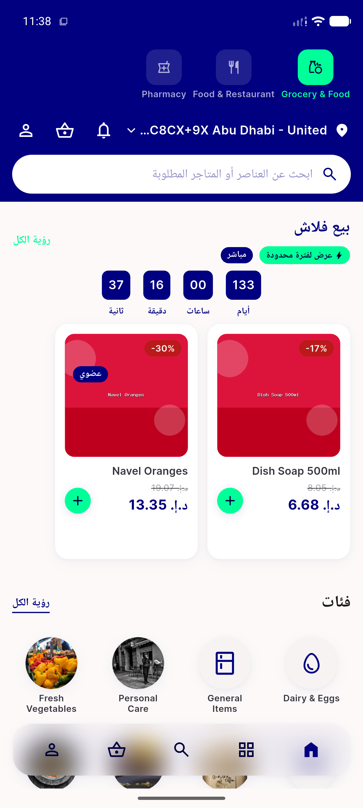

# QA Evidence — NEARS-2429

**PASS -- NCountdownCell DLS promotion, pixel-identical migration verified live (Android emulator-5556)**

**4 screenshot(s).** Click any thumbnail for full resolution.

<table>
<tr>
<td align="center" width="33%"> ac1 ctx1 loaded ar rtl</td>
<td align="center" width="33%"> ac1 ctx2 detailsscreen ar rtl noncompact</td>
<td align="center" width="33%"> ac1 ctx2 flashsaletimerview en noncompact</td>
</tr>
<tr>
<td align="center" width="33%"> regression grocery home ar rtl</td>
</tr>
</table>

### Other artifacts
- [`ac1-compact-shimmer-ar-a11y-dump.xml`](ac1-compact-shimmer-ar-a11y-dump.xml)
- [`ac1-ctx2-a11y-dump.xml`](ac1-ctx2-a11y-dump.xml)

---
*From `nears/docs/qa-evidence/NEARS-2429/` · public-repo scrub policy (no live secrets; verified clean).*
