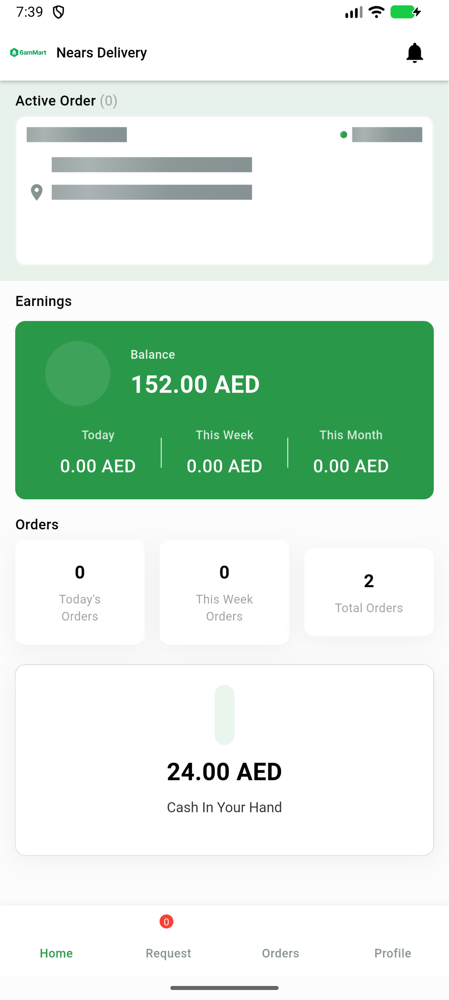
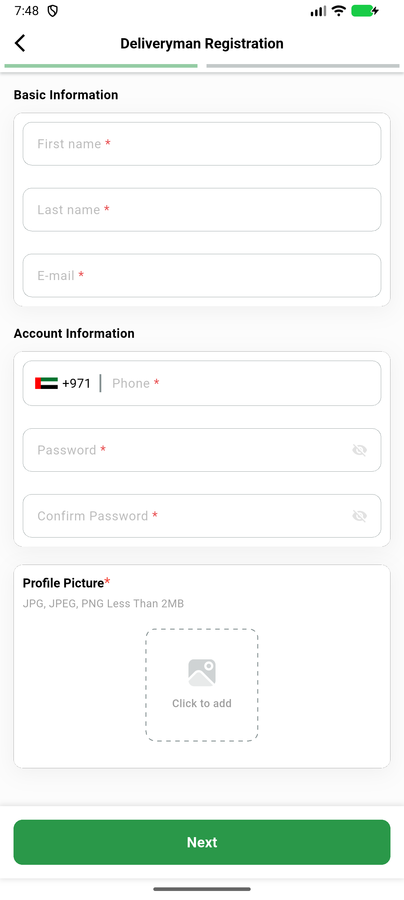

# QA Evidence — NEARS-2433

**PASS: shimmer fill contrast (disabledColor) verified live in light theme, no crash across 9 call sites; dark theme verified analytically (4.34:1 math + widget-test backstop, deferred per light-first policy)**

**2 screenshot(s).** Click any thumbnail for full resolution.

<table>
<tr>
<td align="center" width="33%"> ac1 ac3 order shimmer light</td>
<td align="center" width="33%"> ac3 dm registration no crash</td>
</tr>
</table>

---
*From `nears/docs/qa-evidence/NEARS-2433/` · public-repo scrub policy (no live secrets; verified clean).*
