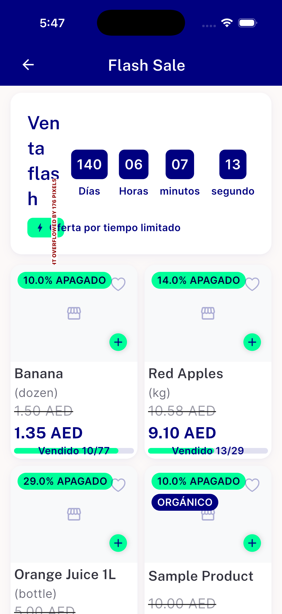
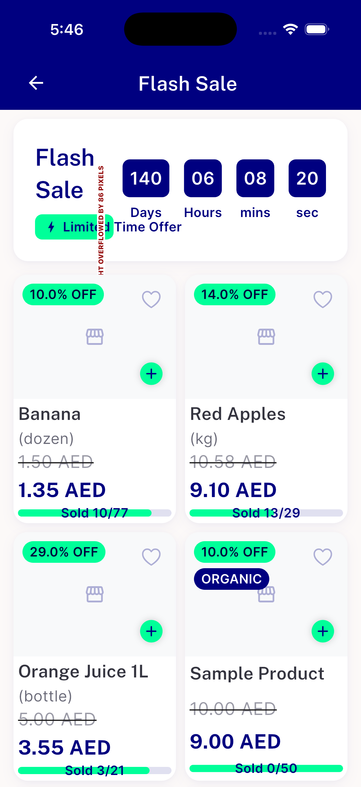
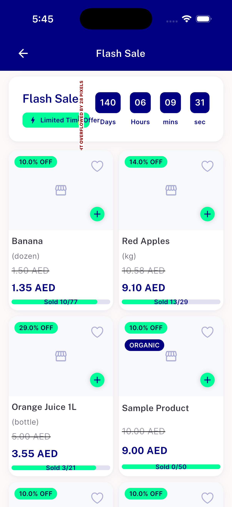
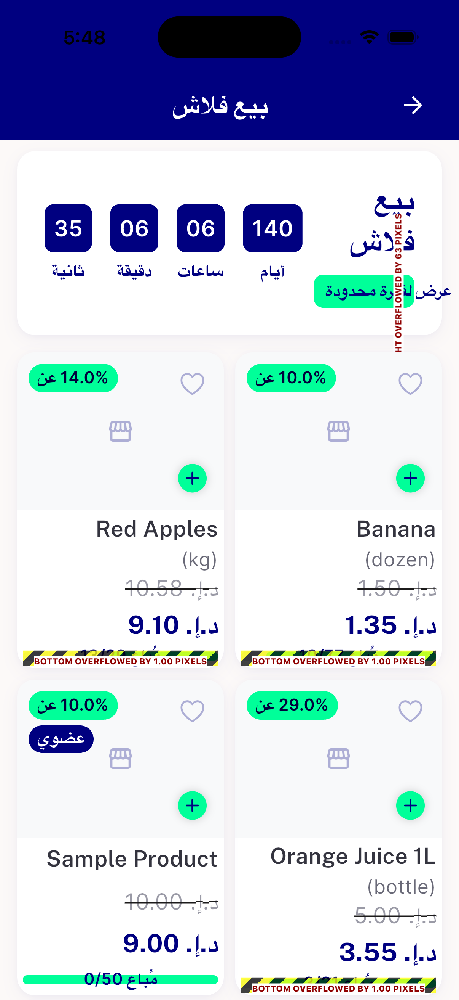

# QA Evidence — NEARS-2435

**PASS — flash-sale product-card overflow fix verified (iOS live + widget-test suite); 1px Arabic+scale edge case found (non-blocking, outside AC)**

**4 screenshot(s).** Click any thumbnail for full resolution.

<table>
<tr>
<td align="center" width="33%"> ac2 es scaled ios</td>
<td align="center" width="33%"> ac3 content completeness scaled ios</td>
<td align="center" width="33%"> ac4 normal scale 402pt ios</td>
</tr>
<tr>
<td align="center" width="33%"> bug ar scaled 1px overflow</td>
</tr>
</table>

### Other artifacts
- [`bug-ar-scaled-1px-overflow.log`](bug-ar-scaled-1px-overflow.log)
- [`bug-timer-header-overflow.log`](bug-timer-header-overflow.log)

---
*From `nears/docs/qa-evidence/NEARS-2435/` · public-repo scrub policy (no live secrets; verified clean).*
