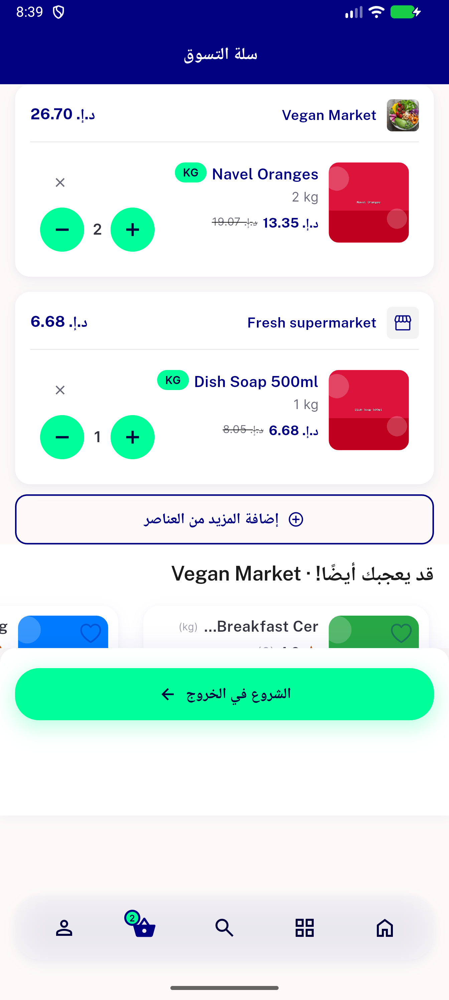

# QA Evidence — NEARS-2438

**PASS - cart empty-state scoped update fix verified live on emulator-5564 (retry cycle 2)**

**2 screenshot(s).** Click any thumbnail for full resolution.

<table>
<tr>
<td align="center" width="33%"> cart empty state</td>
<td align="center" width="33%"> cart populated ac2 ac4</td>
</tr>
</table>

---
*From `nears/docs/qa-evidence/NEARS-2438/` · public-repo scrub policy (no live secrets; verified clean).*
