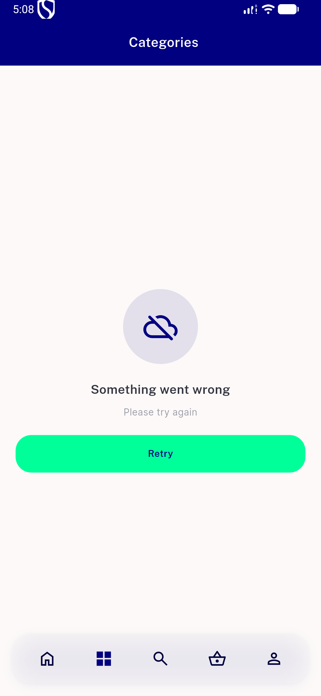
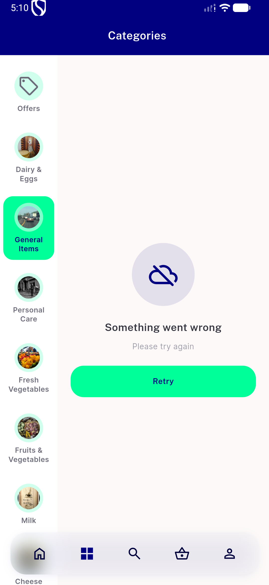
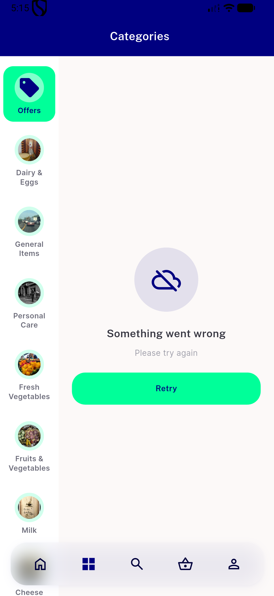
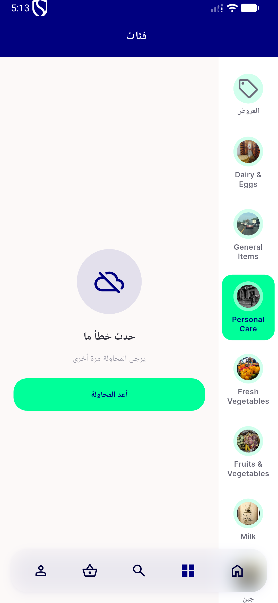
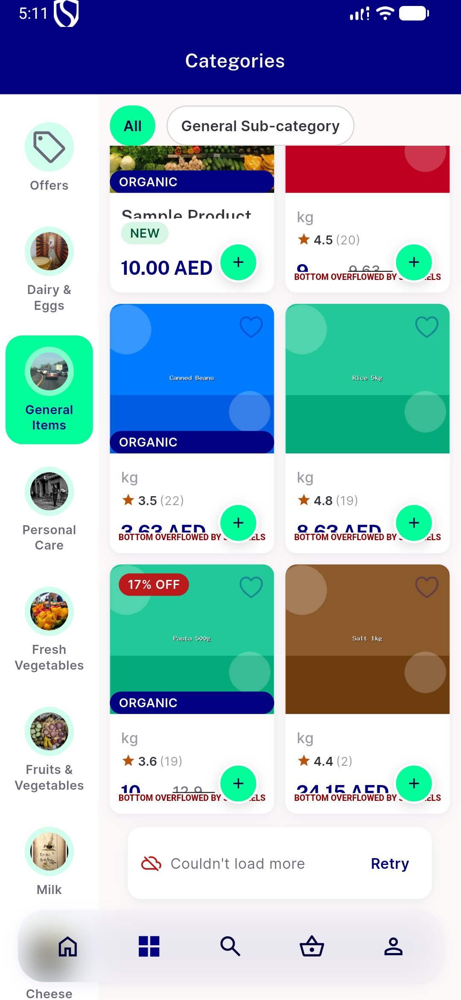
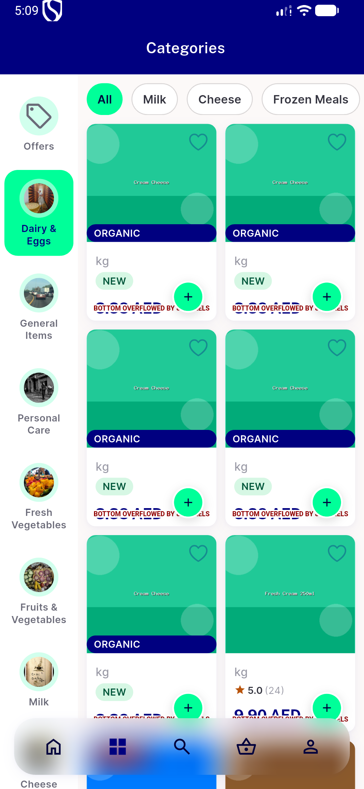

# QA Evidence — NEARS-2446

**PASS - category NErrorRetry swap verified live, both usages + retry callbacks, RTL smoke, LoadMoreError untouched, 137 category tests + full 4447-test suite green**

**6 screenshot(s).** Click any thumbnail for full resolution.

<table>
<tr>
<td align="center" width="33%"> ac1a category list fetch failure</td>
<td align="center" width="33%"> ac1b item grid fetch failure</td>
<td align="center" width="33%"> ac1b offers grid fetch failure</td>
</tr>
<tr>
<td align="center" width="33%"> ac1b rtl arabic smoke</td>
<td align="center" width="33%"> ac2 loadmore error untouched</td>
<td align="center" width="33%"> bug itemwidget bottom overflow</td>
</tr>
</table>

---
*From `nears/docs/qa-evidence/NEARS-2446/` · public-repo scrub policy (no live secrets; verified clean).*
