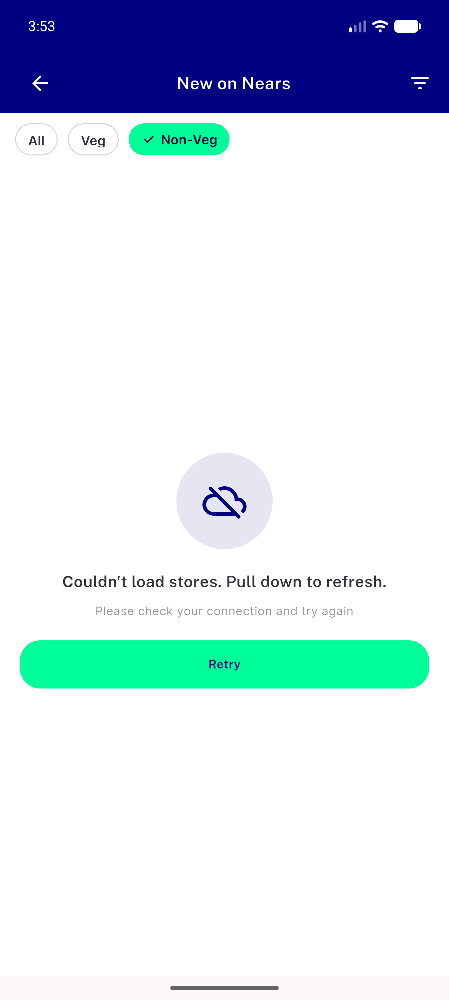
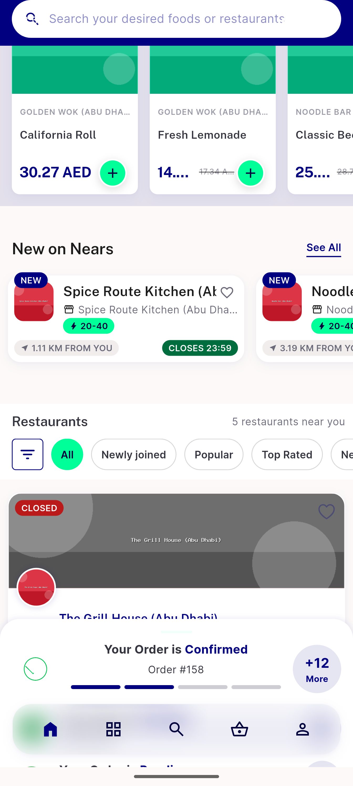

# QA Evidence — NEARS-2447

**PASS - live NearsErrorRetry cold-failure, retry-recovery, filter preservation, warm-cache survival, zone-switch regression all confirmed on emulator-5558**

**2 screenshot(s).** Click any thumbnail for full resolution.

<table>
<tr>
<td align="center" width="33%"> ac1 error retry latest nonveg</td>
<td align="center" width="33%"> regression zone switch new on nears fresh not stale</td>
</tr>
</table>

---
*From `nears/docs/qa-evidence/NEARS-2447/` · public-repo scrub policy (no live secrets; verified clean).*
