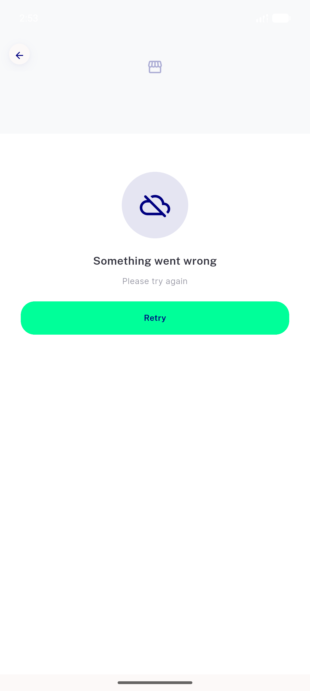
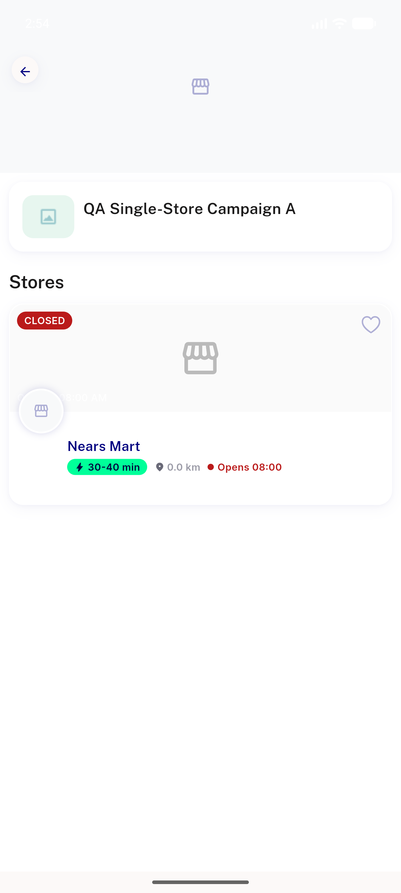
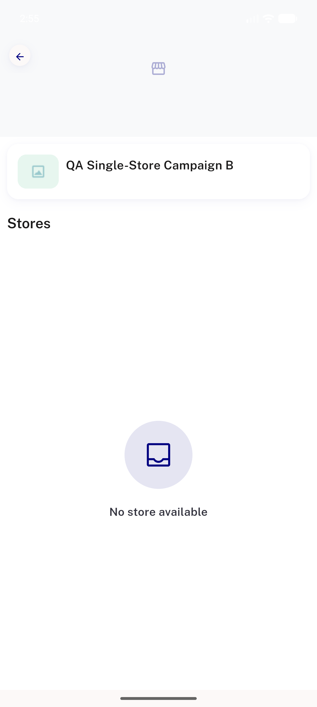
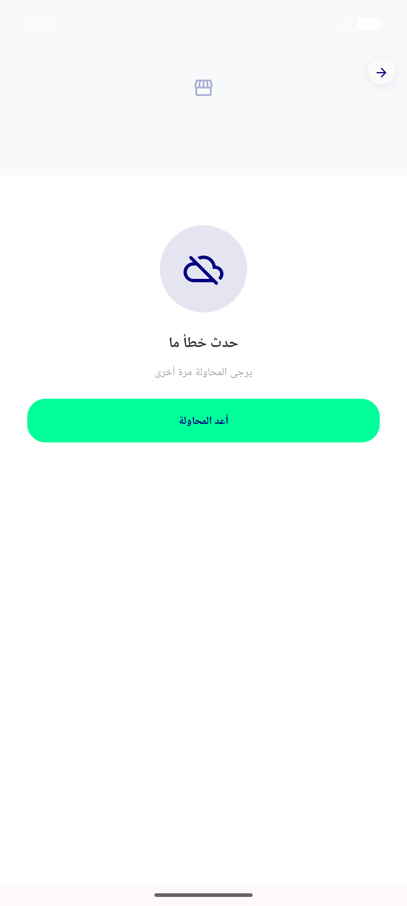

# QA Evidence — NEARS-2448

**FAIL - AC1 gap confirmed live (invalid campaign id -> unhandled TypeError, screen stuck); AC2/AC3/AC4 + regression sweep PASS live on emulator-5558**

**6 screenshot(s).** Click any thumbnail for full resolution.

<table>
<tr>
<td align="center" width="33%"> ac1 success state header store list</td>
<td align="center" width="33%"> ac1 transport failure NErrorRetry</td>
<td align="center" width="33%"> ac2 retry recovers to loaded state</td>
</tr>
<tr>
<td align="center" width="33%"> ac4 empty state not error</td>
<td align="center" width="33%"> bug invalid campaign id stuck blank CONFIRMED LIVE</td>
<td align="center" width="33%"> regression rtl arabic NErrorRetry</td>
</tr>
</table>

### Other artifacts
- [`blocked-device-pool.log`](blocked-device-pool.log)
- [`bug-invalid-campaign-id-CONFIRMED-LIVE.log`](bug-invalid-campaign-id-CONFIRMED-LIVE.log)
- [`bug-invalid-campaign-id-unhandled-typeerror.log`](bug-invalid-campaign-id-unhandled-typeerror.log)
- [`live-qa-session-summary.log`](live-qa-session-summary.log)

---
*From `nears/docs/qa-evidence/NEARS-2448/` · public-repo scrub policy (no live secrets; verified clean).*
