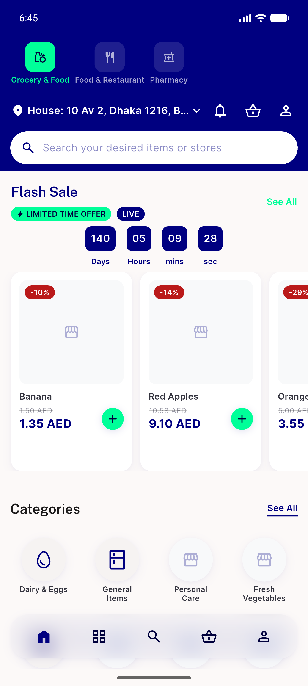

# QA Evidence — NEARS-2449

**PASS — automated widget/unit backstop (24/24 green); live device demonstration structurally blocked by owner-ruled permanent isShop/ecommerce non-reachability (memory: userapp-shop-module-not-a-product-surface)**

**1 screenshot(s).** Click any thumbnail for full resolution.

<table>
<tr>
<td align="center" width="33%"> general app health grocery home</td>
</tr>
</table>

### Other artifacts
- [`automated-backstop-transcript.log`](automated-backstop-transcript.log)

---
*From `nears/docs/qa-evidence/NEARS-2449/` · public-repo scrub policy (no live secrets; verified clean).*
