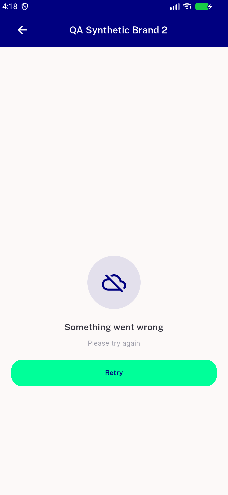
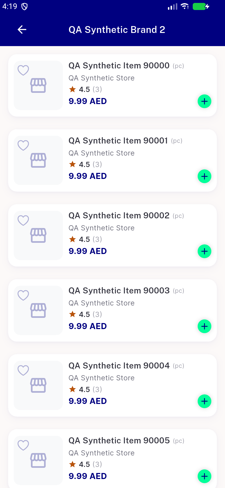
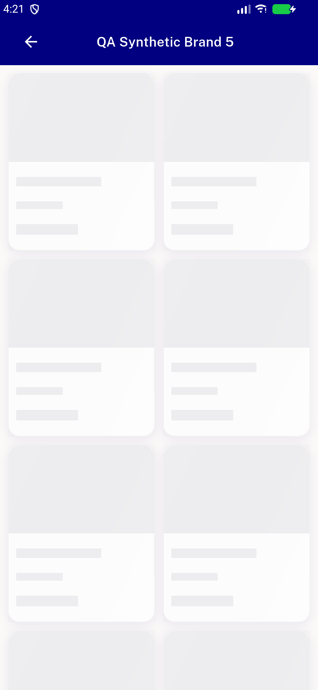
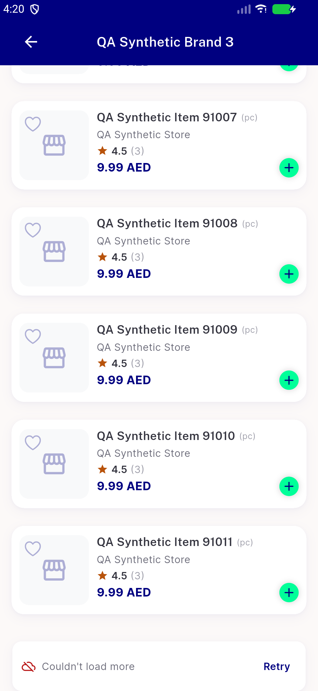
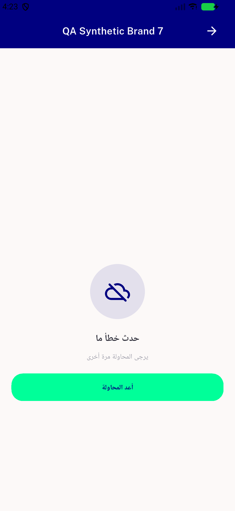

# QA Evidence — NEARS-2450

**PASS - all 4 AC demonstrated live via VM-service deep link + fault/staging proxy; 24/24 automated tests pass**

**6 screenshot(s).** Click any thumbnail for full resolution.

<table>
<tr>
<td align="center" width="33%"> ac1 error retry state</td>
<td align="center" width="33%"> ac2 retry recovery grid</td>
<td align="center" width="33%"> ac3 loading shimmer</td>
</tr>
<tr>
<td align="center" width="33%"> ac4 empty state</td>
<td align="center" width="33%"> regression loadmore footer error</td>
<td align="center" width="33%"> rtl error retry</td>
</tr>
</table>

### Other artifacts
- [`progress.md`](progress.md)

---
*From `nears/docs/qa-evidence/NEARS-2450/` · public-repo scrub policy (no live secrets; verified clean).*
