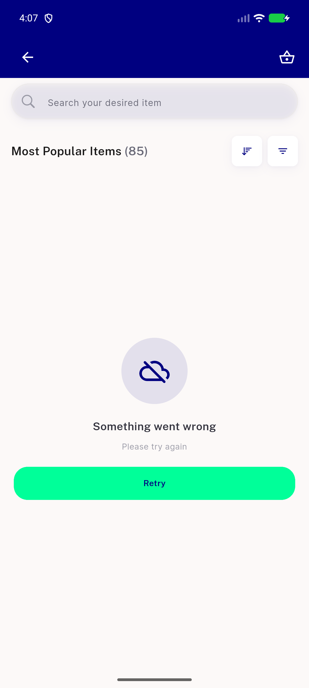
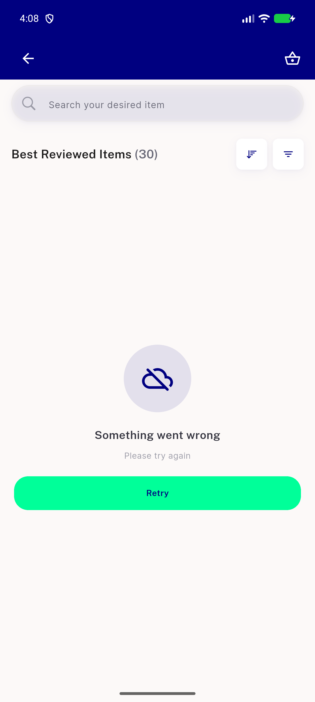
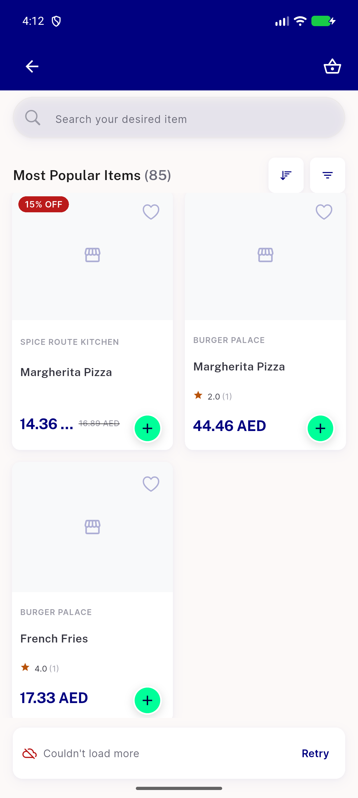

# QA Evidence — NEARS-2451

**PASS - re-publish with regression_bug log evidence**

**4 screenshot(s).** Click any thumbnail for full resolution.

<table>
<tr>
<td align="center" width="33%"> ac1 popular first page error</td>
<td align="center" width="33%"> ac1 reviewed first page error</td>
<td align="center" width="33%"> regression 1840 loadmore footer error</td>
</tr>
<tr>
<td align="center" width="33%"> rtl popular first page error</td>
</tr>
</table>

### Other artifacts
- [`bug-most-reviewed-search-ignored.log`](bug-most-reviewed-search-ignored.log)

---
*From `nears/docs/qa-evidence/NEARS-2451/` · public-repo scrub policy (no live secrets; verified clean).*
