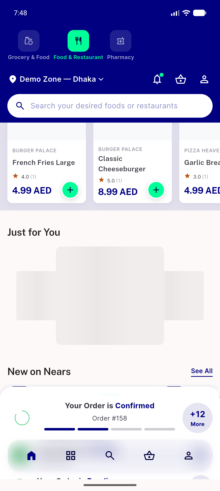

# QA Evidence — NEARS-2452

**FAIL - AC1/AC2 NErrorRetry branch unreachable via only wired live UI entry (JustForYouView hides See All on null-state); AC3 regression clean; code correct in isolation (widget test 3/3 pass)**

**2 screenshot(s).** Click any thumbnail for full resolution.

<table>
<tr>
<td align="center" width="33%"> ac3 regression just for you populated</td>
<td align="center" width="33%"> bug justforyou entry hidden on campaign fetch failure</td>
</tr>
</table>

### Other artifacts
- [`bug-justforyou-entry-hidden-on-campaign-fetch-failure.xml`](bug-justforyou-entry-hidden-on-campaign-fetch-failure.xml)
- [`progress.md`](progress.md)

---
*From `nears/docs/qa-evidence/NEARS-2452/` · public-repo scrub policy (no live secrets; verified clean).*
