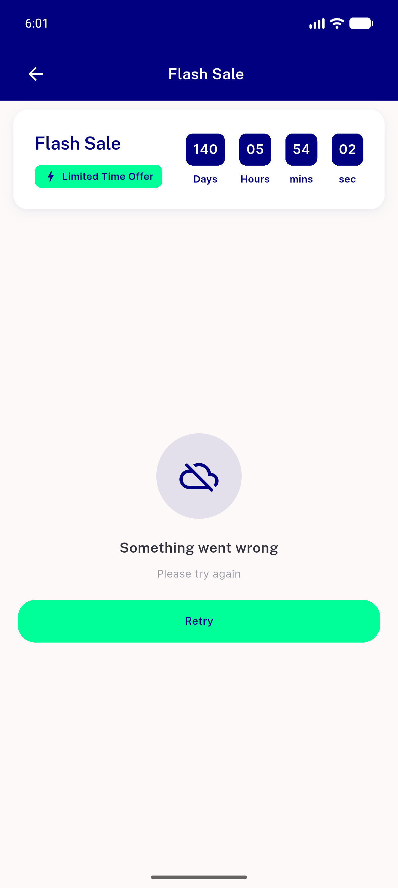

# QA Evidence — NEARS-2453

**PASS — NErrorRetry swap in Flash Sale Details, no visible/behavioral change (emulator-5554)**

**3 screenshot(s).** Click any thumbnail for full resolution.

<table>
<tr>
<td align="center" width="33%"> ac1 ac2 error state</td>
<td align="center" width="33%"> ac1 retry recovered</td>
<td align="center" width="33%"> ac2 loaded grid</td>
</tr>
</table>

---
*From `nears/docs/qa-evidence/NEARS-2453/` · public-repo scrub policy (no live secrets; verified clean).*
