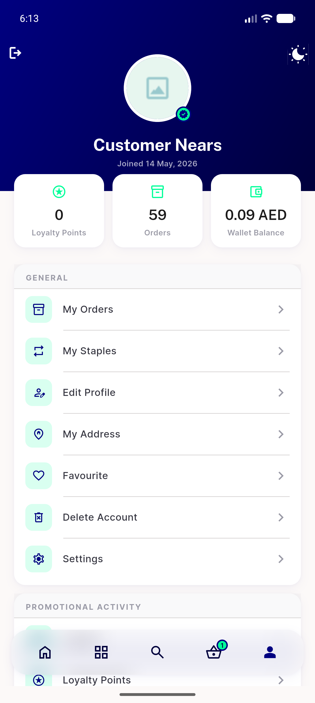
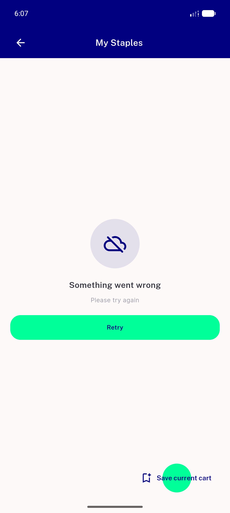
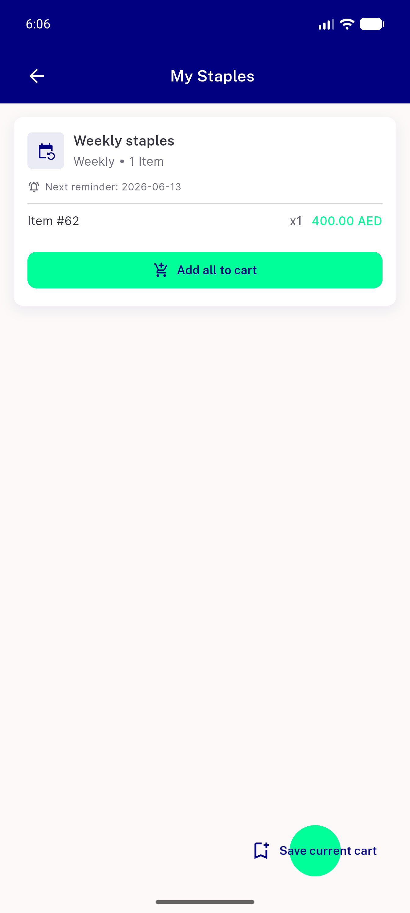

# QA Evidence — NEARS-2454

**PASS — staples error-retry swap to catalog NErrorRetry, all states verified live on emulator-5558**

**3 screenshot(s).** Click any thumbnail for full resolution.

<table>
<tr>
<td align="center" width="33%"> empty state</td>
<td align="center" width="33%"> error state</td>
<td align="center" width="33%"> success state</td>
</tr>
</table>

---
*From `nears/docs/qa-evidence/NEARS-2454/` · public-repo scrub policy (no live secrets; verified clean).*
