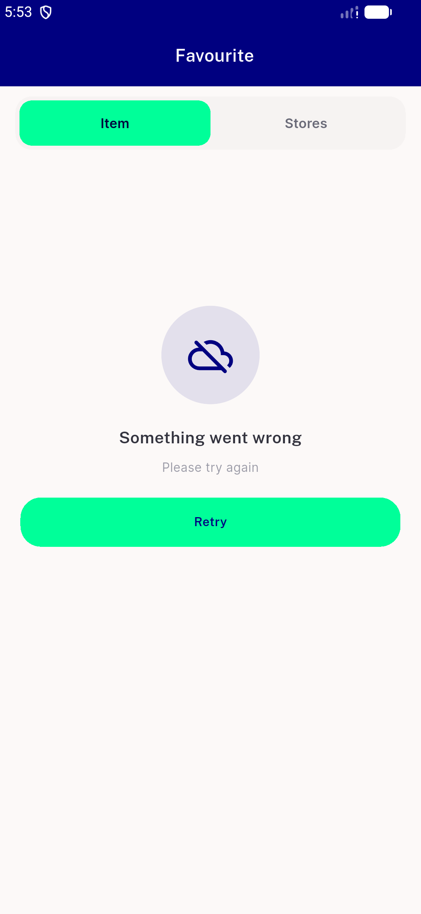
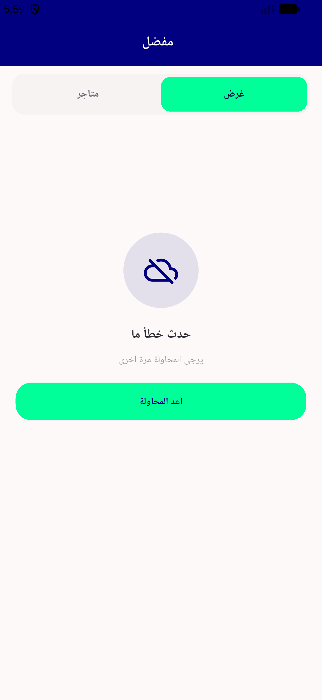

# QA Evidence — NEARS-2455

**PASS — NErrorRetry swap in FavItemViewWidget verified live (LTR+RTL), all states re-checked, automated backstop 20/20 green**

**2 screenshot(s).** Click any thumbnail for full resolution.

<table>
<tr>
<td align="center" width="33%"> error state item tab</td>
<td align="center" width="33%"> error state rtl arabic</td>
</tr>
</table>

### Other artifacts
- [`bug-profile-screen-renderflex-overflow.log`](bug-profile-screen-renderflex-overflow.log)

---
*From `nears/docs/qa-evidence/NEARS-2455/` · public-repo scrub policy (no live secrets; verified clean).*
