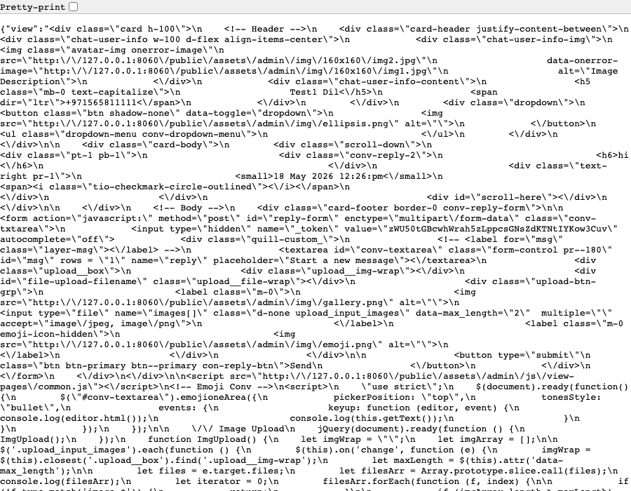
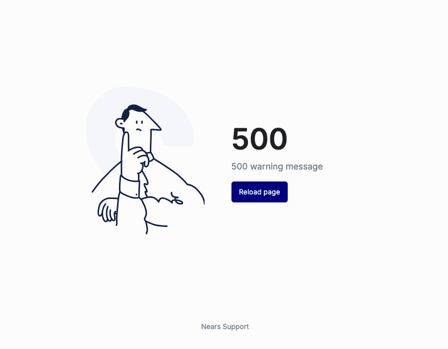

# QA Evidence — NEARS-2457

**PASS - Admin messages/view null-guard fix, delivery_man+vendor+customer all verified**

**2 screenshot(s).** Click any thumbnail for full resolution.

<table>
<tr>
<td align="center" width="33%"> ac4 after delivery man fixed</td>
<td align="center" width="33%"> bug ac4 before 500 crash</td>
</tr>
</table>

---
*From `nears/docs/qa-evidence/NEARS-2457/` · public-repo scrub policy (no live secrets; verified clean).*
