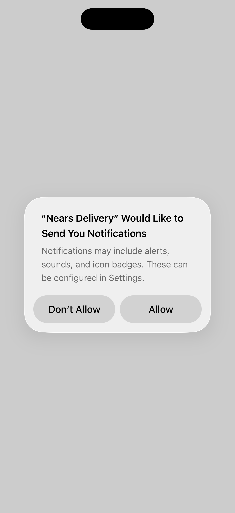

# QA Evidence — NEARS-2458

**PASS - iOS Podfile.lock Firebase 12.14.0 pin sync verified live (pod install idempotent, build+launch clean, all 4955 flutter tests green)**

**2 screenshot(s).** Click any thumbnail for full resolution.

<table>
<tr>
<td align="center" width="33%"> ios sim boot</td>
<td align="center" width="33%"> ios sim framebuffer alive</td>
</tr>
</table>

### Other artifacts
- [`ac2-firebase-init-log.log`](ac2-firebase-init-log.log)
- [`bug-regression-killed-launch-getinitialmessage.log`](bug-regression-killed-launch-getinitialmessage.log)

---
*From `nears/docs/qa-evidence/NEARS-2458/` · public-repo scrub policy (no live secrets; verified clean).*
