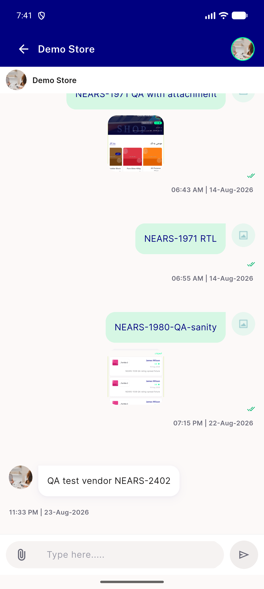
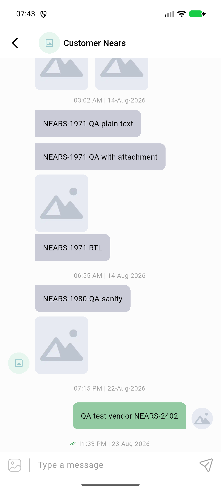

# QA Evidence — NEARS-2459

**PASS - AC1 UserApp + AC2 VendorApp chat header PII-strip live smoke, both clean, no crash, no raw-null artifact**

**2 screenshot(s).** Click any thumbnail for full resolution.

<table>
<tr>
<td align="center" width="33%"> userapp chat header</td>
<td align="center" width="33%"> vendorapp chat header</td>
</tr>
</table>

### Other artifacts
- [`progress.md`](progress.md)
- [`userapp-chat-header-dump.xml`](userapp-chat-header-dump.xml)
- [`vendorapp-chat-header-dump.xml`](vendorapp-chat-header-dump.xml)

---
*From `nears/docs/qa-evidence/NEARS-2459/` · public-repo scrub policy (no live secrets; verified clean).*
