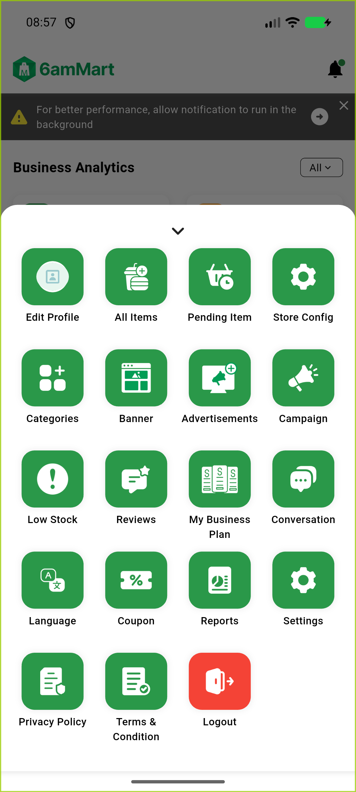

# QA Evidence — NEARS-2460

**PASS - AC1 store21 subscription-expiry fix verified live on emulator-5566 (fix-cycle 1 delta re-QA retry); regression guard store19 clean**

**2 screenshot(s).** Click any thumbnail for full resolution.

<table>
<tr>
<td align="center" width="33%"> store19 menu regression check</td>
<td align="center" width="33%"> store21 menu no expiry gate</td>
</tr>
</table>

### Other artifacts
- [`bug-vendor-subscription-transaction-offset-typeerror.log`](bug-vendor-subscription-transaction-offset-typeerror.log)
- [`progress.md`](progress.md)

---
*From `nears/docs/qa-evidence/NEARS-2460/` · public-repo scrub policy (no live secrets; verified clean).*
