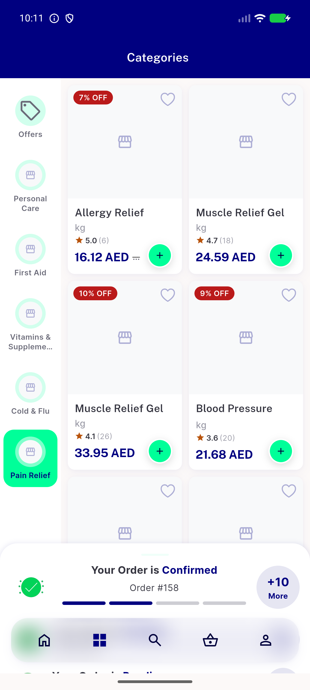
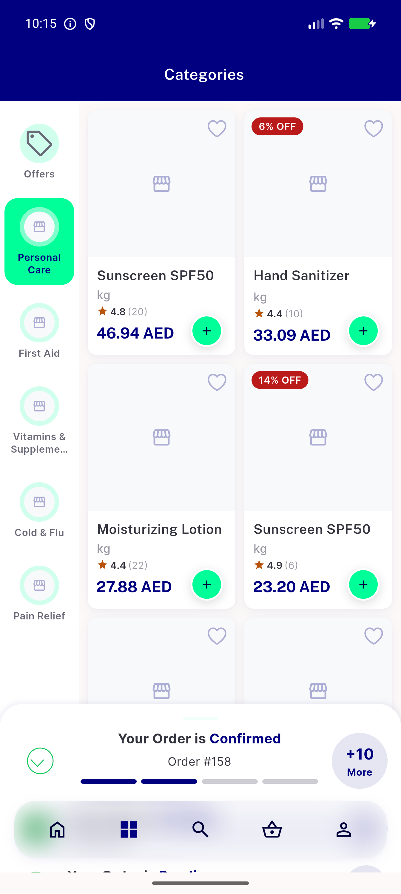
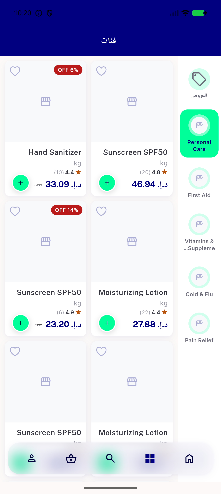
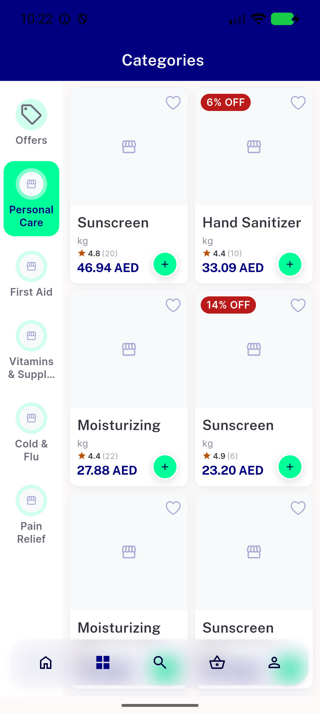
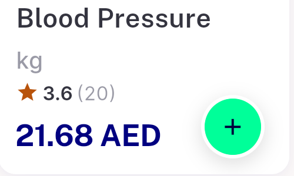
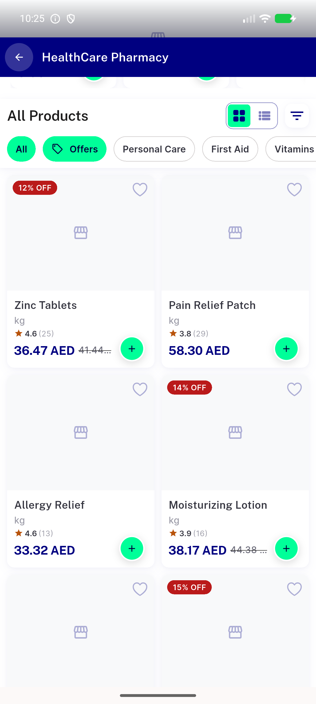
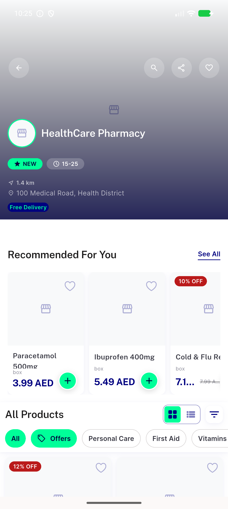

# QA Evidence — NEARS-2467

**PASS - AC1/AC2/AC3 live-verified, zero RenderFlex overflow, pre-existing NEARS-2142 name-legibility gap flagged as regression_bug**

**7 screenshot(s).** Click any thumbnail for full resolution.

<table>
<tr>
<td align="center" width="33%"> ac1 category grid default scale</td>
<td align="center" width="33%"> ac1 category grid item2 personalcare</td>
<td align="center" width="33%"> ac2 rtl arabic personalcare grid</td>
</tr>
<tr>
<td align="center" width="33%"> ac3 textscale130 personalcare grid</td>
<td align="center" width="33%"> bug name legibility crop blood pressure monitor</td>
<td align="center" width="33%"> scope4 store screen grid allproducts</td>
</tr>
<tr>
<td align="center" width="33%"> scope4 store screen grid top</td>
</tr>
</table>

### Other artifacts
- [`ac3-rendertree-price-spacer-0dp.log`](ac3-rendertree-price-spacer-0dp.log)

---
*From `nears/docs/qa-evidence/NEARS-2467/` · public-repo scrub policy (no live secrets; verified clean).*
