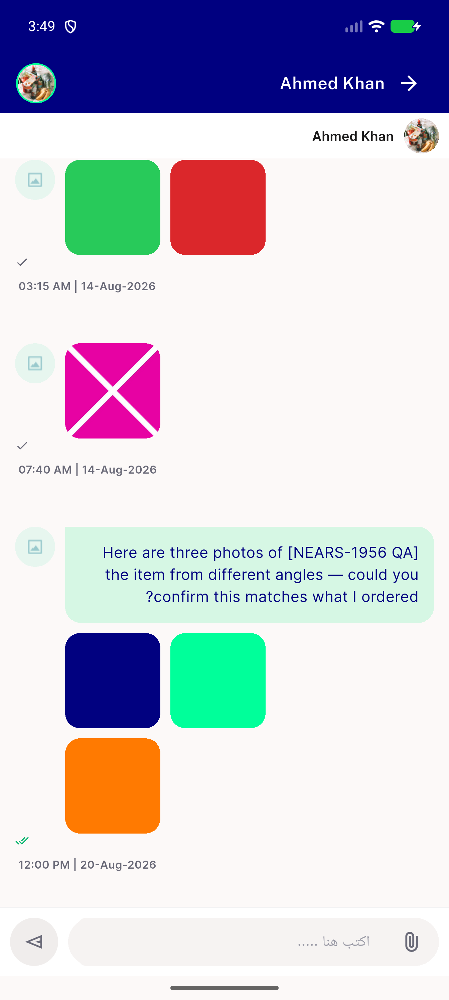
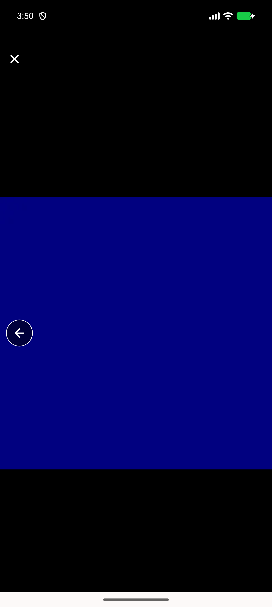
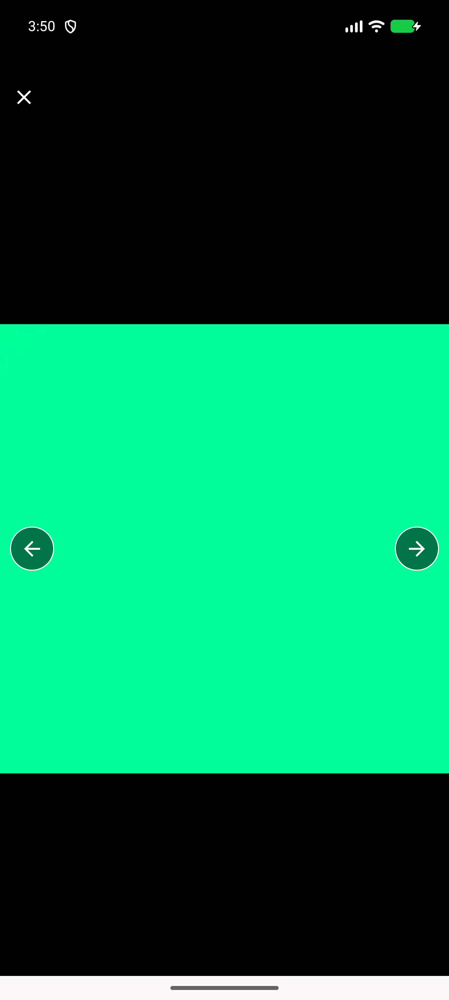
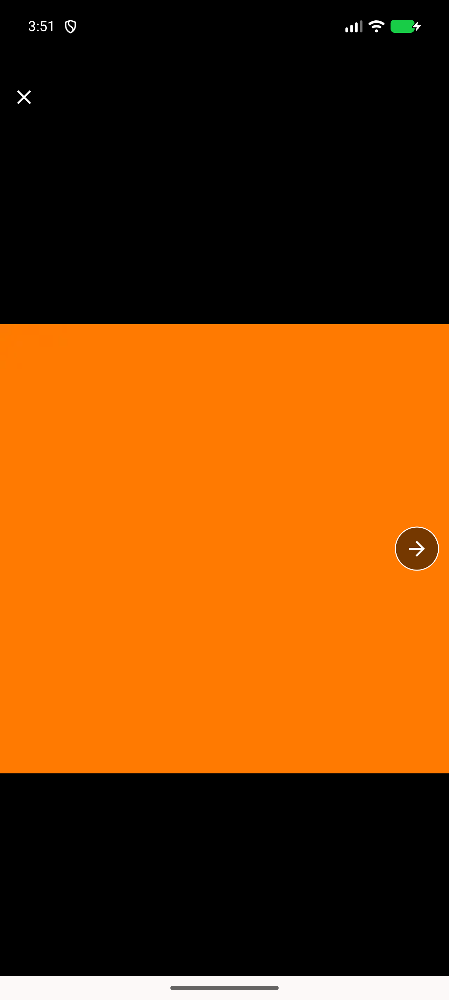

# QA Evidence — NEARS-2468

**PASS — chat lightbox RTL directionality verified live under genuine Arabic locale; all 3 mechanisms (swipe gesture, Row order, NIcon mirroring) cohere; grid stays LTR-pinned; no code diff needed**

**4 screenshot(s).** Click any thumbnail for full resolution.

<table>
<tr>
<td align="center" width="33%"> ac1a grid tile order rtl</td>
<td align="center" width="33%"> ac1b lightbox index0</td>
<td align="center" width="33%"> ac1c lightbox after swipe index1</td>
</tr>
<tr>
<td align="center" width="33%"> ac3 index2 orange</td>
</tr>
</table>

---
*From `nears/docs/qa-evidence/NEARS-2468/` · public-repo scrub policy (no live secrets; verified clean).*
