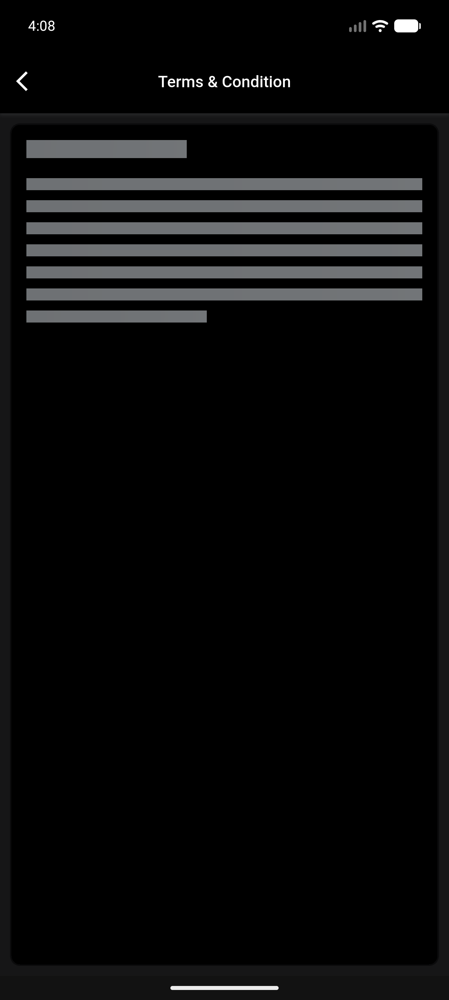
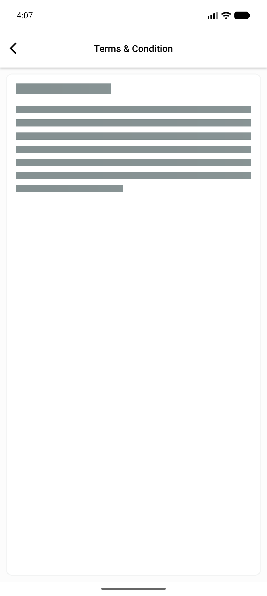

# QA Evidence — NEARS-2469

**PASS — live device (emulator-5562), light+dark skeleton captured, WCAG contrast confirmed visually, 18/18 automated tests pass**

**2 screenshot(s).** Click any thumbnail for full resolution.

<table>
<tr>
<td align="center" width="33%"> dark skeleton terms</td>
<td align="center" width="33%"> light skeleton terms</td>
</tr>
</table>

---
*From `nears/docs/qa-evidence/NEARS-2469/` · public-repo scrub policy (no live secrets; verified clean).*
