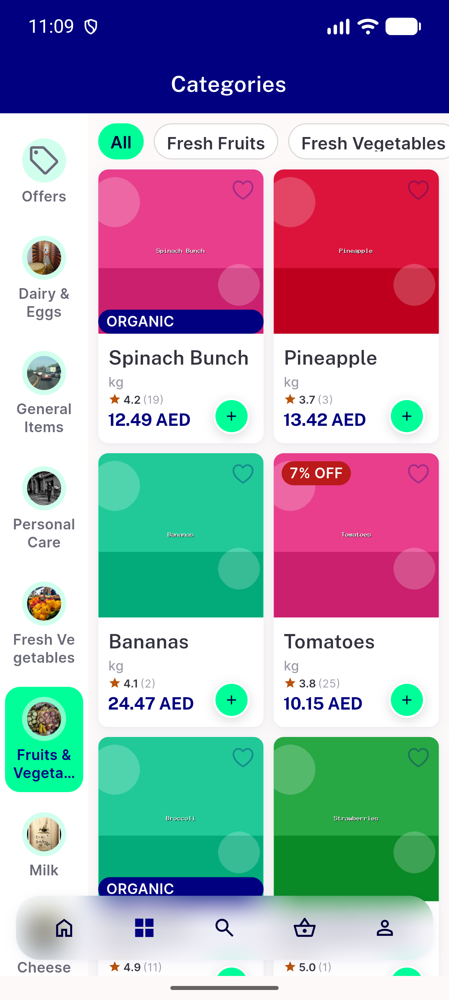
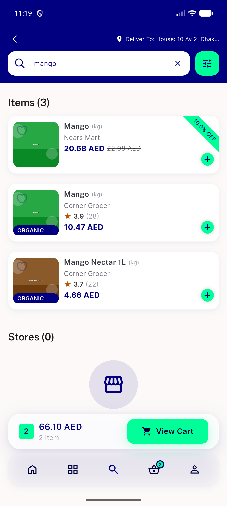
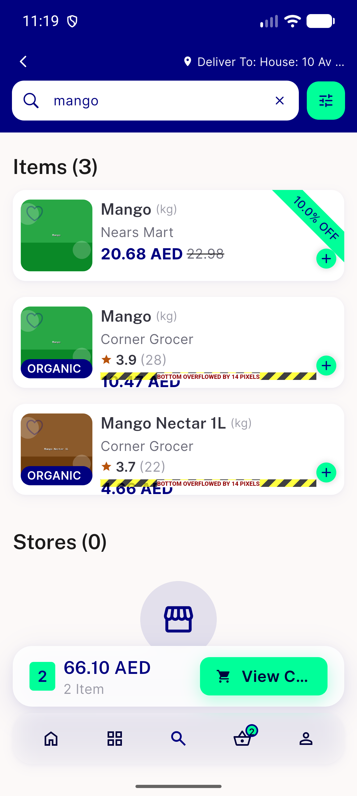
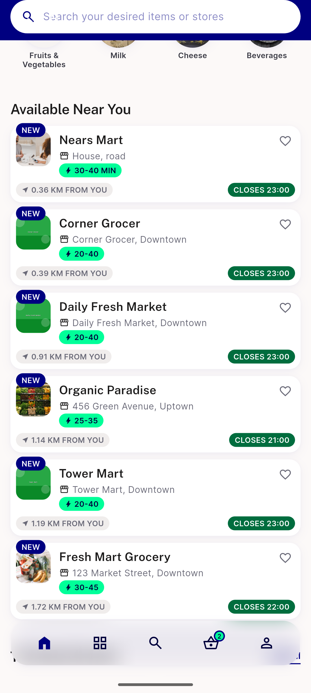
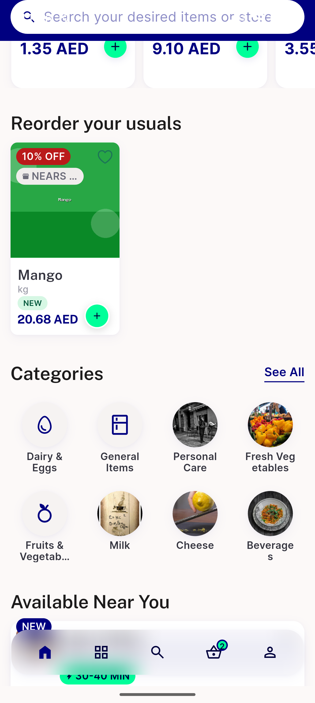

# QA Evidence — NEARS-2470

**PASS — discount-price row no longer truncates at 1.3x on grid rail / list card; live-verified EN+AR/RTL; 4/4 AC met; 2 pre-existing unrelated regressions flagged**

**14 screenshot(s).** Click any thumbnail for full resolution.

<table>
<tr>
<td align="center" width="33%"> bug reorder rail strike price invisible 165dp</td>
<td align="center" width="33%"> bug search list rating row overflow 1.3x</td>
<td align="center" width="33%"> grid 100pct baseline</td>
</tr>
<tr>
<td align="center" width="33%"> grid 130pct fruitsveg</td>
<td align="center" width="33%"> grid 130pct nondiscount check</td>
<td align="center" width="33%"> list 100pct search mango</td>
</tr>
<tr>
<td align="center" width="33%"> list 130pct AR RTL search mango</td>
<td align="center" width="33%"> list 130pct search mango</td>
<td align="center" width="33%"> rail 100pct mango 2</td>
</tr>
<tr>
<td align="center" width="33%"> rail 100pct mango 3</td>
<td align="center" width="33%"> rail 100pct mango</td>
<td align="center" width="33%"> rail 130pct AR RTL mango</td>
</tr>
<tr>
<td align="center" width="33%"> rail 130pct mango 2</td>
<td align="center" width="33%"> rail 130pct mango</td>
</tr>
</table>

### Other artifacts
- [`bug-search-list-rating-row-overflow-1.3x.log`](bug-search-list-rating-row-overflow-1.3x.log)

---
*From `nears/docs/qa-evidence/NEARS-2470/` · public-repo scrub policy (no live secrets; verified clean).*
