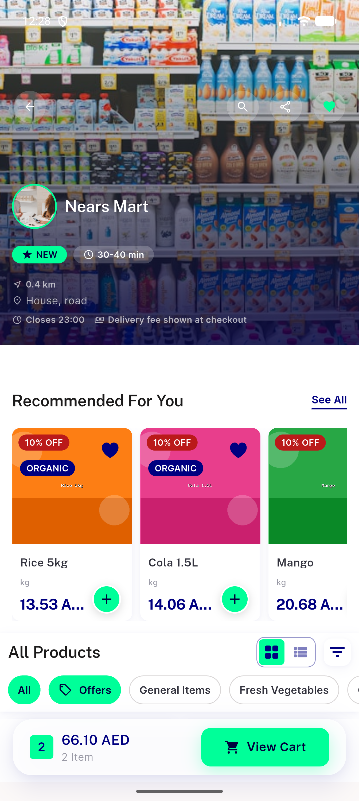
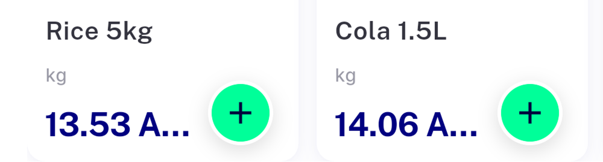
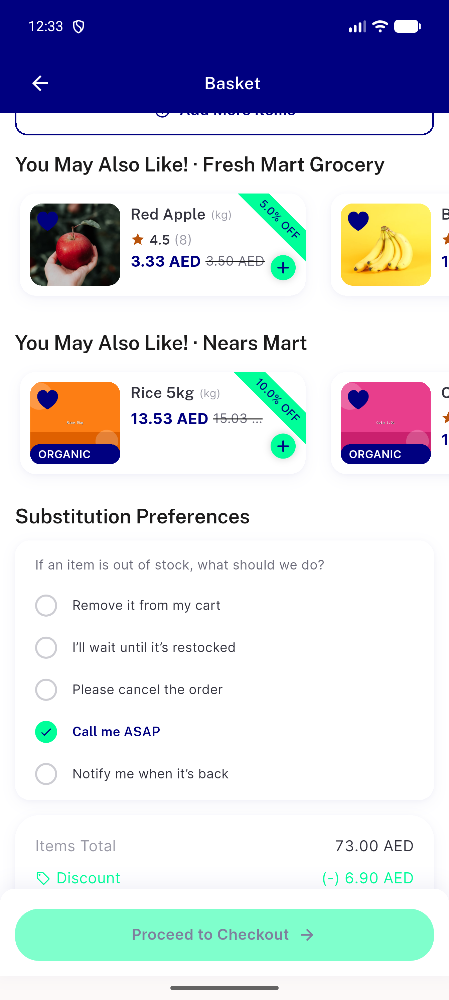
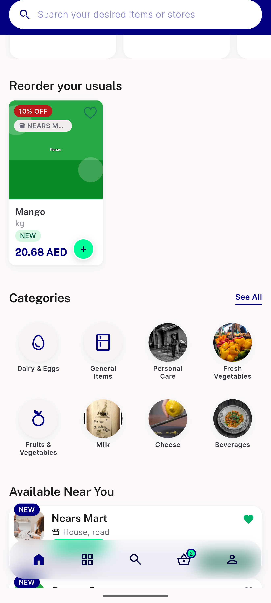
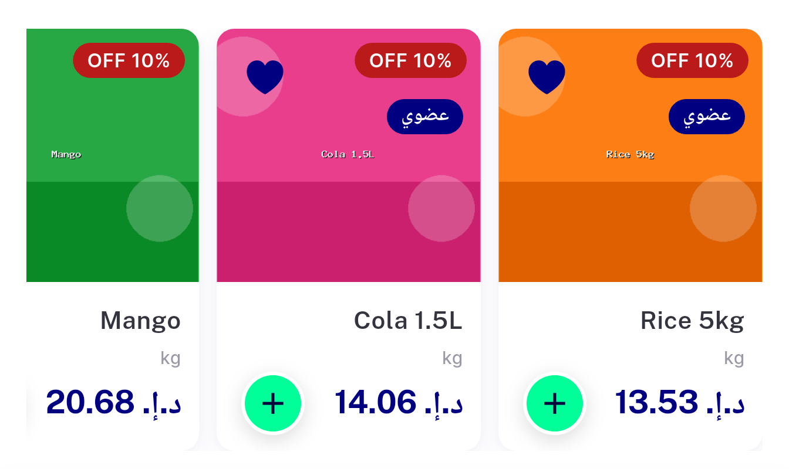
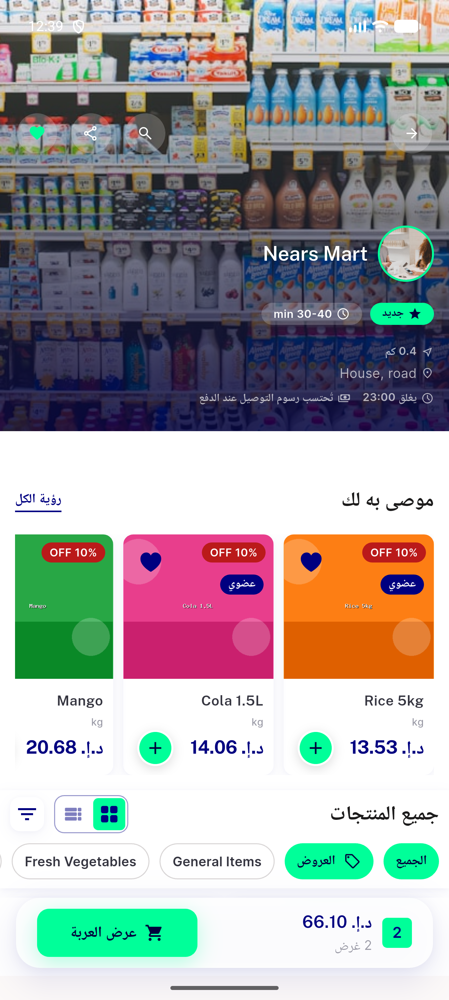

# QA Evidence — NEARS-2471

**FAIL - AC1 current-price truncation reproduced live on the real Recommended For You rail (150dp)**

**8 screenshot(s).** Click any thumbnail for full resolution.

<table>
<tr>
<td align="center" width="33%"> ac1 ac2 recommended rail</td>
<td align="center" width="33%"> ac3 non discount rail</td>
<td align="center" width="33%"> bug nitemcard current price truncates recommended rail</td>
</tr>
<tr>
<td align="center" width="33%"> cart suggestion rail</td>
<td align="center" width="33%"> crop2</td>
<td align="center" width="33%"> home reorder rail</td>
</tr>
<tr>
<td align="center" width="33%"> rtl crop</td>
<td align="center" width="33%"> rtl recommended rail</td>
</tr>
</table>

---
*From `nears/docs/qa-evidence/NEARS-2471/` · public-repo scrub policy (no live secrets; verified clean).*
