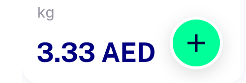

# QA Evidence — NEARS-2471

**cycle2 delta re-QA: AC1/AC4 PASS at real 150dp rail, AC2 ambiguous-strike-drop flagged**

**2 screenshot(s).** Click any thumbnail for full resolution.

<table>
<tr>
<td align="center" width="33%"> cycle2 recommended rail 150dp</td>
<td align="center" width="33%"> cycle2 red apple price crop</td>
</tr>
</table>

---
*From `nears/docs/qa-evidence/NEARS-2471/` · public-repo scrub policy (no live secrets; verified clean).*
