# QA Evidence — NEARS-2472

**PASS — AC1-AC4 demonstrated live on emulator-5554 (Pixel_10_Pro_2), 100% text scale confirmed; regression sweep clean (RTL, >100% scale, rated-item parity); automated backstop 6/6 new tests + widget suite green**

**19 screenshot(s).** Click any thumbnail for full resolution.

<table>
<tr>
<td align="center" width="33%"><a href="ac-rtl-store-screen-arabic.png">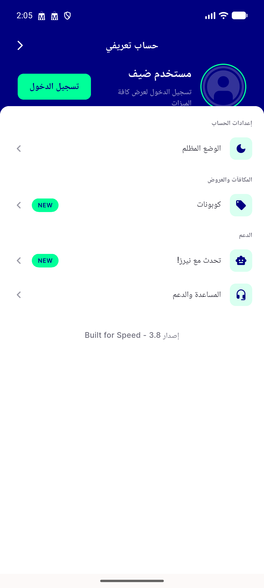</a> ac rtl store screen arabic</td>
<td align="center" width="33%"><a href="ac1-category-100pct.png">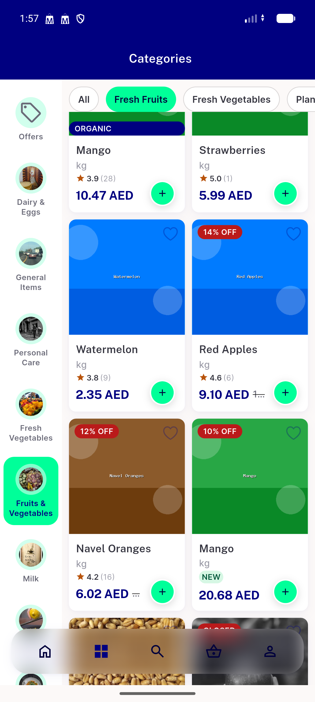</a> ac1 category 100pct</td>
<td align="center" width="33%"><a href="ac1-category-screen-new-badge.png">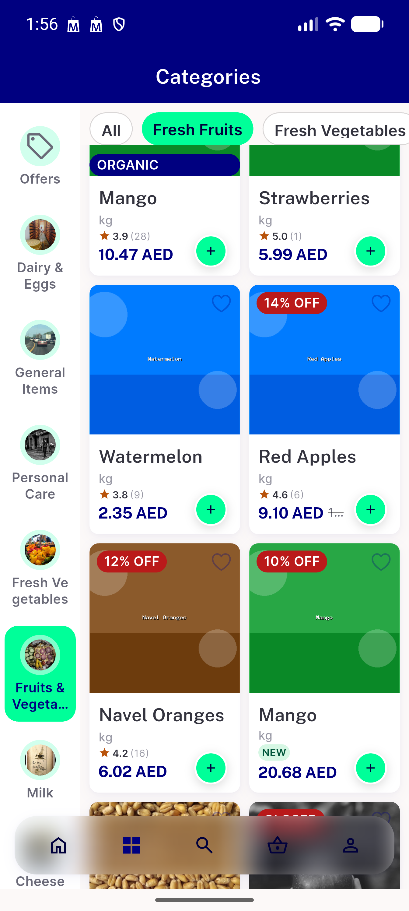</a> ac1 category screen new badge</td>
</tr>
<tr>
<td align="center" width="33%"><a href="ac2-store-100pct.png">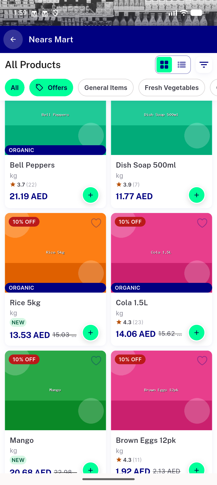</a> ac2 store 100pct</td>
<td align="center" width="33%"><a href="ac2-store-allproducts-grid.png">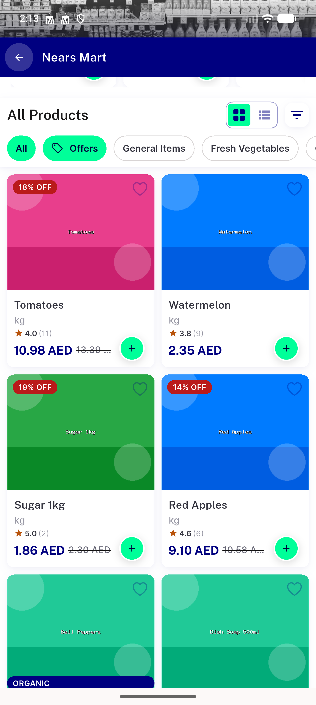</a> ac2 store allproducts grid</td>
<td align="center" width="33%"><a href="ac2-store-grid-new-badge-2.png">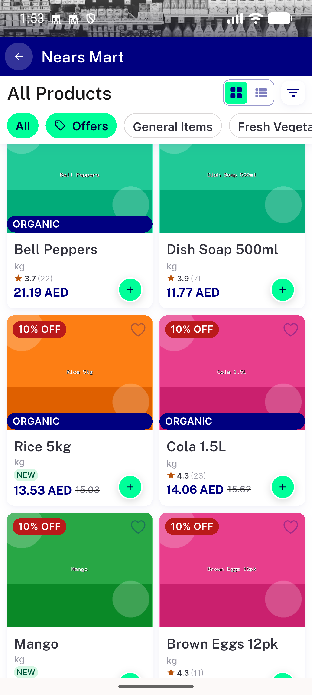</a> ac2 store grid new badge 2</td>
</tr>
<tr>
<td align="center" width="33%"><a href="ac2-store-grid-new-badge.png">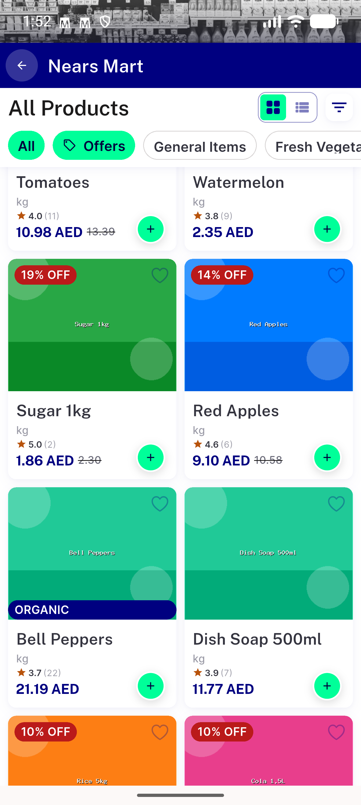</a> ac2 store grid new badge</td>
<td align="center" width="33%"><a href="ac2-store-screen-grid-2.png">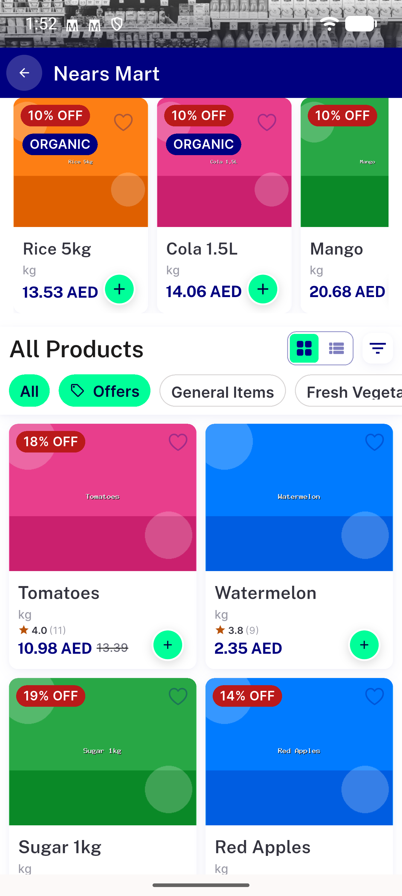</a> ac2 store screen grid 2</td>
<td align="center" width="33%"><a href="ac2-store-screen-grid.png">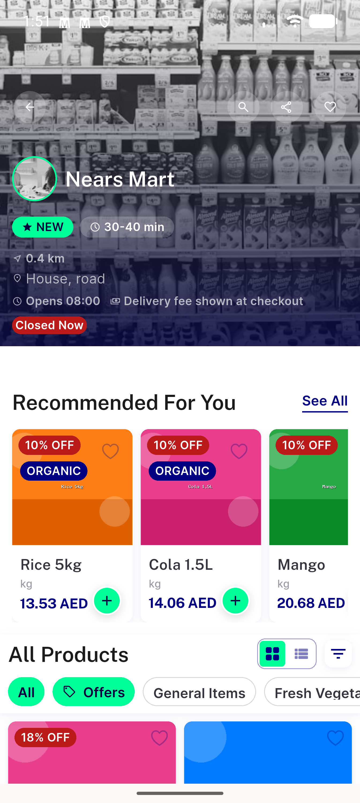</a> ac2 store screen grid</td>
</tr>
<tr>
<td align="center" width="33%"><a href="ac2-store-screen-unrated-new-badge.png">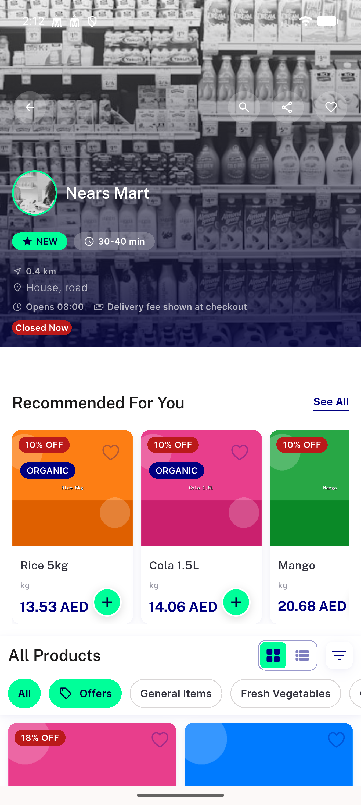</a> ac2 store screen unrated new badge</td>
<td align="center" width="33%"><a href="category-screen-1.png">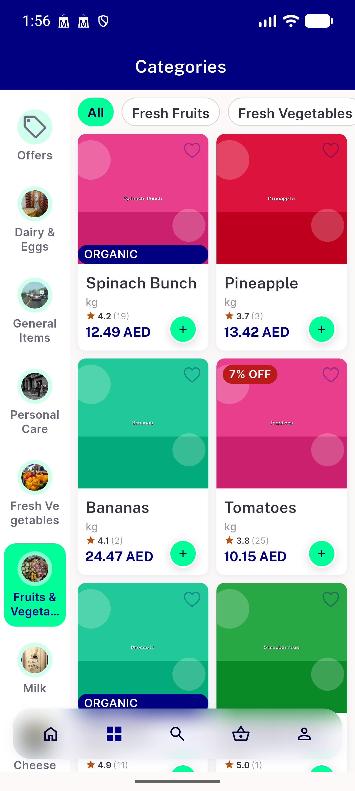</a> category screen 1</td>
<td align="center" width="33%"><a href="profile-guest.png">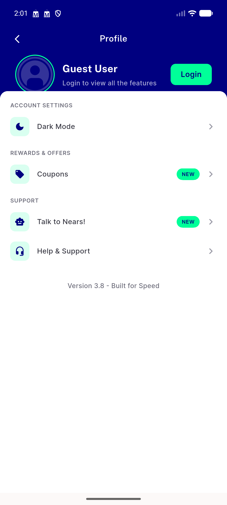</a> profile guest</td>
</tr>
<tr>
<td align="center" width="33%"><a href="regression-rtl-store-new-badge.png">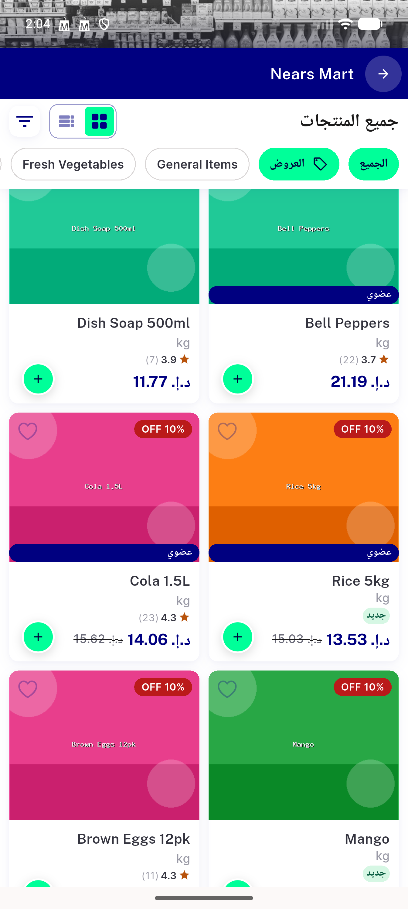</a> regression rtl store new badge</td>
<td align="center" width="33%"><a href="regression-rtl-store.png">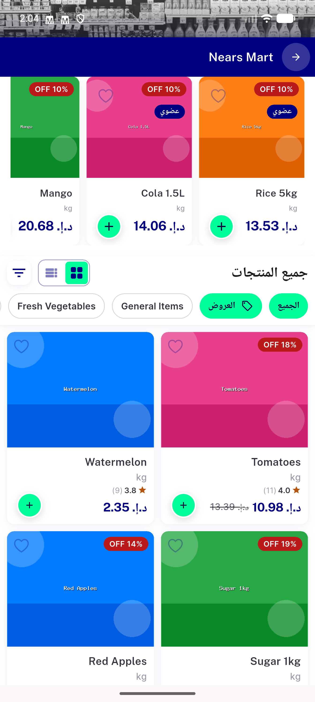</a> regression rtl store</td>
<td align="center" width="33%"><a href="regression-scaledup-130pct.png">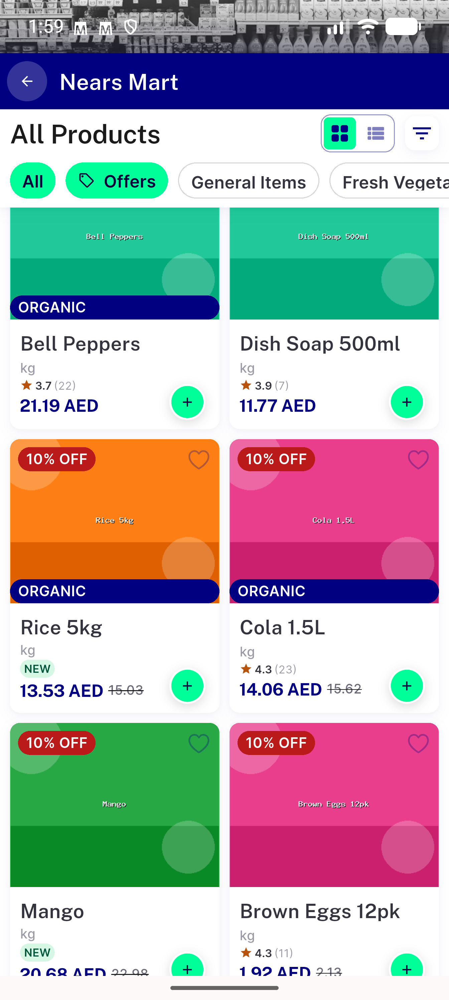</a> regression scaledup 130pct</td>
</tr>
<tr>
<td align="center" width="33%"><a href="reorder-usuals-2.png">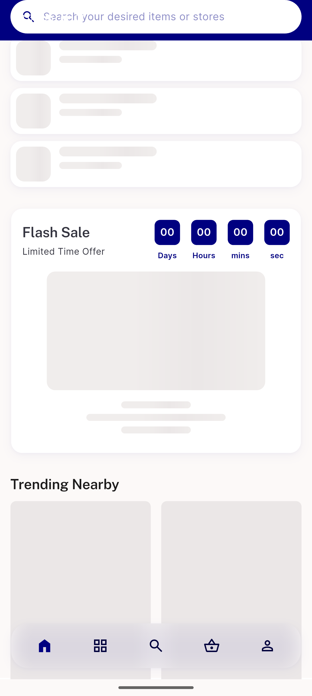</a> reorder usuals 2</td>
<td align="center" width="33%"><a href="reorder-usuals-3.png">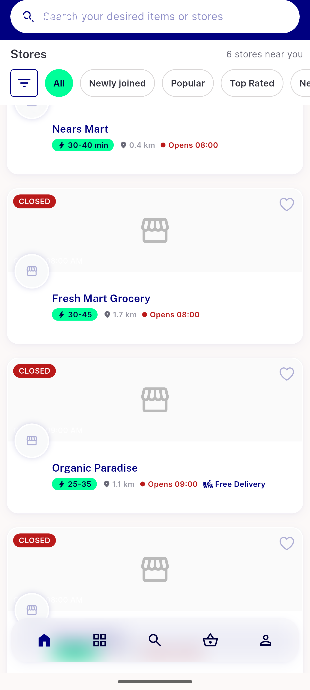</a> reorder usuals 3</td>
<td align="center" width="33%"><a href="reorder-usuals-check.png">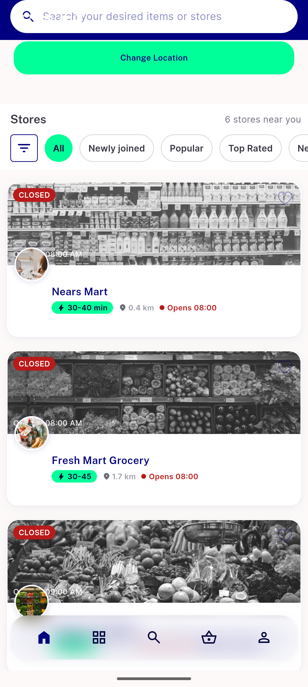</a> reorder usuals check</td>
</tr>
<tr>
<td align="center" width="33%"><a href="reorder-usuals.png">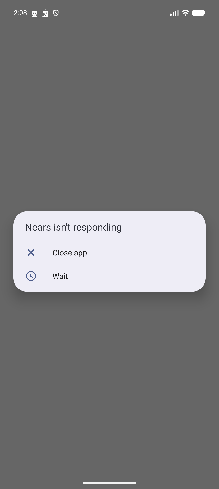</a> reorder usuals</td>
</tr>
</table>

### Other artifacts
- [`badge_dump.xml`](badge_dump.xml)

---
*From `nears/docs/qa-evidence/NEARS-2472/` · public-repo scrub policy (no live secrets; verified clean).*
