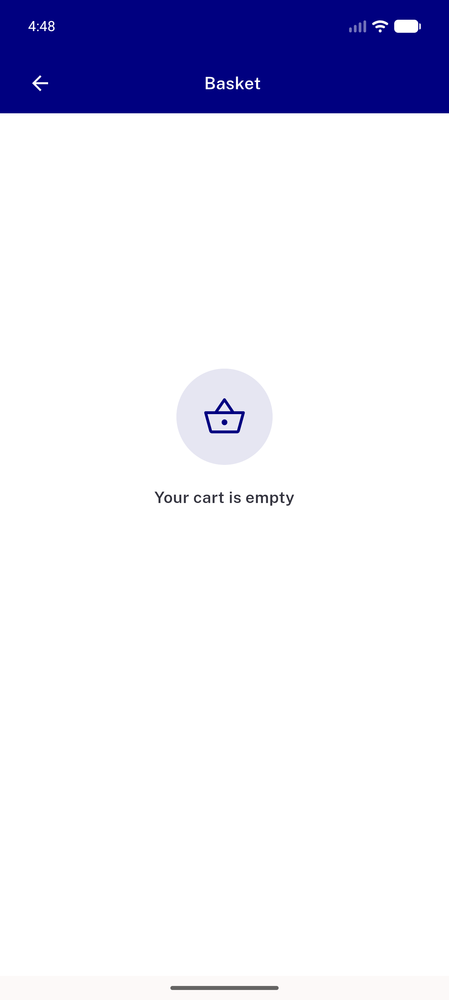

# QA Evidence — NEARS-2473

**PASS — AC1/AC2/AC3 demonstrated live on emulator-5558, real local backend**

**3 screenshot(s).** Click any thumbnail for full resolution.

<table>
<tr>
<td align="center" width="33%"> ac1 empty transition</td>
<td align="center" width="33%"> ac2 partial removal</td>
<td align="center" width="33%"> ac3 clamp not removed</td>
</tr>
</table>

---
*From `nears/docs/qa-evidence/NEARS-2473/` · public-repo scrub policy (no live secrets; verified clean).*
