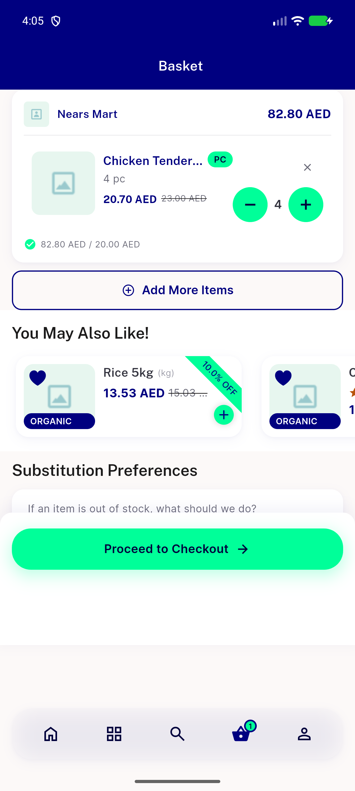
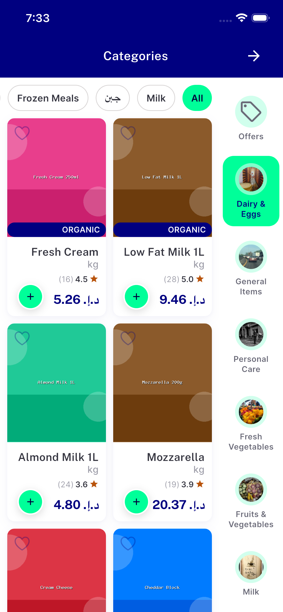
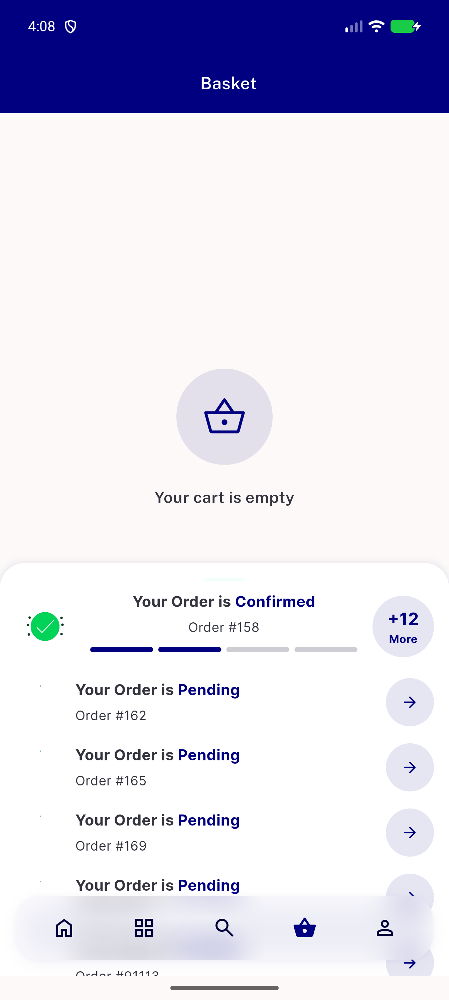

# QA Evidence — NEARS-2474

**Android real-device tap-driven re-verification: AC1-3 fully tap-driven, AC4 wiring confirmed via real tap + prior evaluate-driven gate proof**

**6 screenshot(s).** Click any thumbnail for full resolution.

<table>
<tr>
<td align="center" width="33%"> ac1 red baseline android realtap</td>
<td align="center" width="33%"> ac1 red baseline ghost row</td>
<td align="center" width="33%"> ac2 green android realtap</td>
</tr>
<tr>
<td align="center" width="33%"> ac2 green no ghost row</td>
<td align="center" width="33%"> ac4 checkout gate blocked single store</td>
<td align="center" width="33%"> ac4 real tap diagnostic still open</td>
</tr>
</table>

### Other artifacts
- [`ac1-red-baseline-net-log.txt`](ac1-red-baseline-net-log.txt)
- [`ac4-group-checkout-gate-log.txt`](ac4-group-checkout-gate-log.txt)
- [`ac4-group-checkout-gate-source.txt`](ac4-group-checkout-gate-source.txt)
- [`ac4-real-tap-diagnostic-notes.txt`](ac4-real-tap-diagnostic-notes.txt)
- [`bug-flash-sale-countdown-overflow.log`](bug-flash-sale-countdown-overflow.log)
- [`bug-killed-launch-notification-failure.log`](bug-killed-launch-notification-failure.log)

---
*From `nears/docs/qa-evidence/NEARS-2474/` · public-repo scrub policy (no live secrets; verified clean).*
