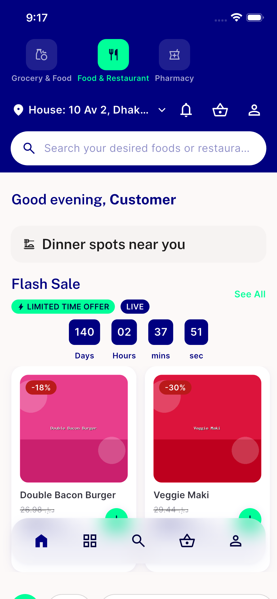
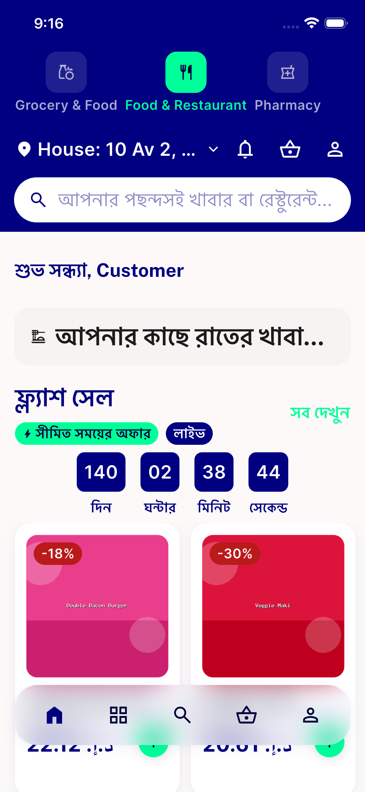
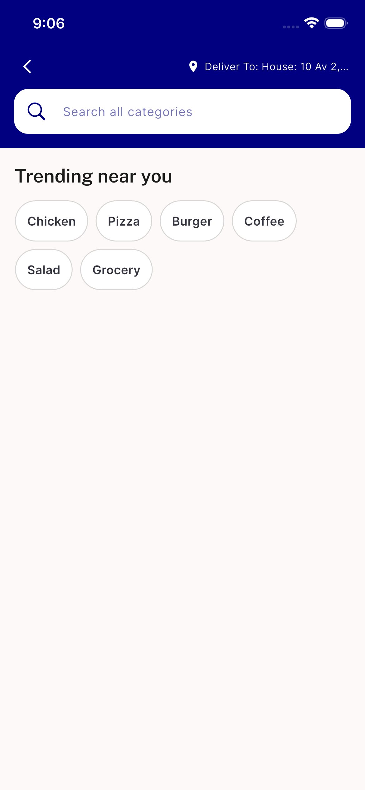

# QA Evidence — NEARS-2476

**PASS -- rapid RTL/text-scale transition non-reproducible after 6 reps (iOS substitute, Android pool saturated); 3 AC2 steady states clean; advisory long-string gap also clean**

**3 screenshot(s).** Click any thumbnail for full resolution.

<table>
<tr>
<td align="center" width="33%"> reset to baseline</td>
<td align="center" width="33%"> steady bn locale 130pct scale</td>
<td align="center" width="33%"> steady ltr 100pct dashboard</td>
</tr>
</table>

### Other artifacts
- [`automated-backstop-widget-test.log`](automated-backstop-widget-test.log)
- [`benign-raw-eval-artifact.log`](benign-raw-eval-artifact.log)
- [`rapid-toggle-results.log`](rapid-toggle-results.log)
- [`steady-states-render-tree.log`](steady-states-render-tree.log)

---
*From `nears/docs/qa-evidence/NEARS-2476/` · public-repo scrub policy (no live secrets; verified clean).*
