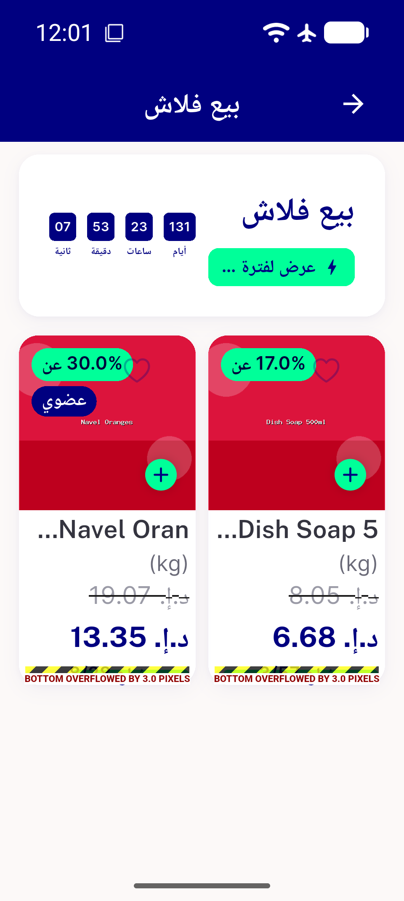
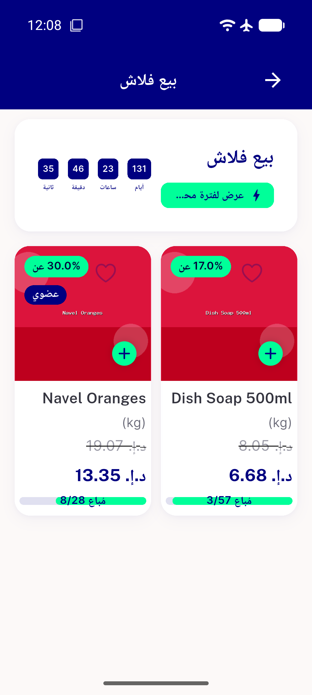

# QA Evidence — NEARS-2483

**FAIL: AC2 live overflow (3.0px) at ar/1.3x/320dp — fix does not close the defect for discount+unit items; AC3/fontFallback PASS**

**4 screenshot(s).** Click any thumbnail for full resolution.

<table>
<tr>
<td align="center" width="33%"> ac2 ar 320dp 1.3x overflow 1</td>
<td align="center" width="33%"> ac2 ar 320dp 1.3x overflow 2</td>
<td align="center" width="33%"> ac3 en 320dp 1.3x</td>
</tr>
<tr>
<td align="center" width="33%"> font fallback ar 1.0x</td>
</tr>
</table>

### Other artifacts
- [`bug-ac2-ar-1.3x-overflow.log`](bug-ac2-ar-1.3x-overflow.log)
- [`bug-regression-n_item_card-overflow.log`](bug-regression-n_item_card-overflow.log)

---
*From `nears/docs/qa-evidence/NEARS-2483/` · public-repo scrub policy (no live secrets; verified clean).*
