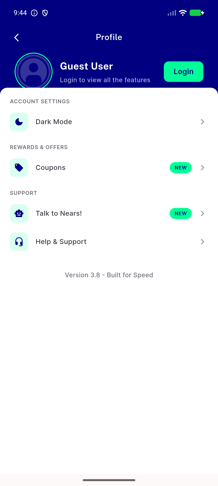
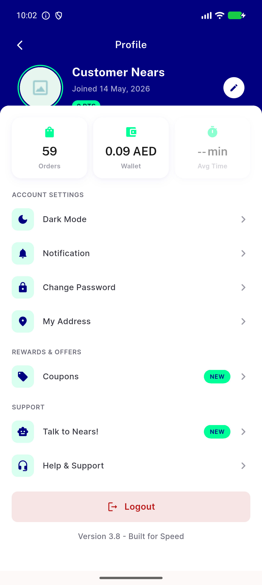

# QA Evidence — NEARS-2484

**FAIL - scroll-overflow fix works (AC1/AC2 confirmed, zero RenderFlex) but exposes scroll-position-reset defect breaking AC3**

**4 screenshot(s).** Click any thumbnail for full resolution.

<table>
<tr>
<td align="center" width="33%"> ac2 guest profile natural viewport</td>
<td align="center" width="33%"> ac2 loggedin natural viewport</td>
<td align="center" width="33%"> bug profile scroll position reset t0 scrolled</td>
</tr>
<tr>
<td align="center" width="33%"> bug profile scroll position reset t5 idle</td>
</tr>
</table>

### Other artifacts
- [`bug-profile-scroll-position-reset-t0-scrolled.xml`](bug-profile-scroll-position-reset-t0-scrolled.xml)
- [`bug-profile-scroll-position-reset-t5-idle.xml`](bug-profile-scroll-position-reset-t5-idle.xml)
- [`bug-profile-scroll-position-reset.log`](bug-profile-scroll-position-reset.log)

---
*From `nears/docs/qa-evidence/NEARS-2484/` · public-repo scrub policy (no live secrets; verified clean).*
