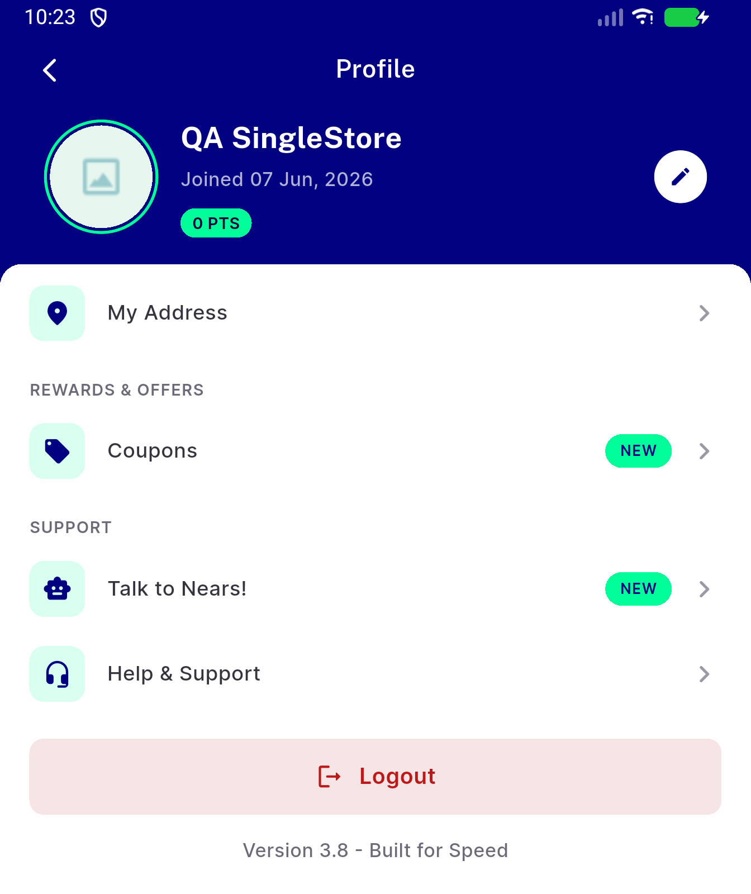
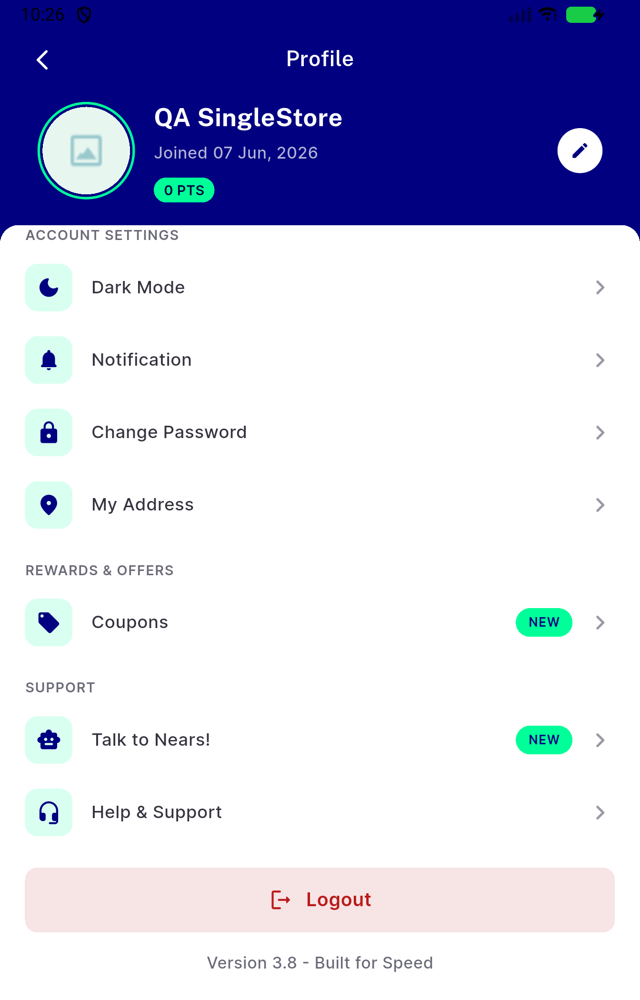

# QA Evidence — NEARS-2484

**PASS delta re-QA fix-cycle 2 (commit 848fa20d) — AC3 scroll-position-reset regression confirmed fixed at both viewport heights**

**8 screenshot(s).** Click any thumbnail for full resolution.

<table>
<tr>
<td align="center" width="33%"> ac2 guest profile natural viewport</td>
<td align="center" width="33%"> ac2 loggedin natural viewport</td>
<td align="center" width="33%"> ac3 redemo 1344x1600 t0 scrolled</td>
</tr>
<tr>
<td align="center" width="33%"> ac3 redemo 1344x1600 t8 idle</td>
<td align="center" width="33%"> ac3 redemo 1344x2100 t0 scrolled</td>
<td align="center" width="33%"> ac3 redemo 1344x2100 t8 idle</td>
</tr>
<tr>
<td align="center" width="33%"> bug profile scroll position reset t0 scrolled</td>
<td align="center" width="33%"> bug profile scroll position reset t5 idle</td>
</tr>
</table>

### Other artifacts
- [`ac3-redemo-1344x1600-t0-scrolled.xml`](ac3-redemo-1344x1600-t0-scrolled.xml)
- [`ac3-redemo-1344x1600-t8-idle.xml`](ac3-redemo-1344x1600-t8-idle.xml)
- [`ac3-redemo-1344x2100-t0-scrolled.xml`](ac3-redemo-1344x2100-t0-scrolled.xml)
- [`ac3-redemo-1344x2100-t8-idle.xml`](ac3-redemo-1344x2100-t8-idle.xml)
- [`bug-profile-scroll-position-reset-t0-scrolled.xml`](bug-profile-scroll-position-reset-t0-scrolled.xml)
- [`bug-profile-scroll-position-reset-t5-idle.xml`](bug-profile-scroll-position-reset-t5-idle.xml)
- [`bug-profile-scroll-position-reset.log`](bug-profile-scroll-position-reset.log)
- [`progress.md`](progress.md)

---
*From `nears/docs/qa-evidence/NEARS-2484/` · public-repo scrub policy (no live secrets; verified clean).*
