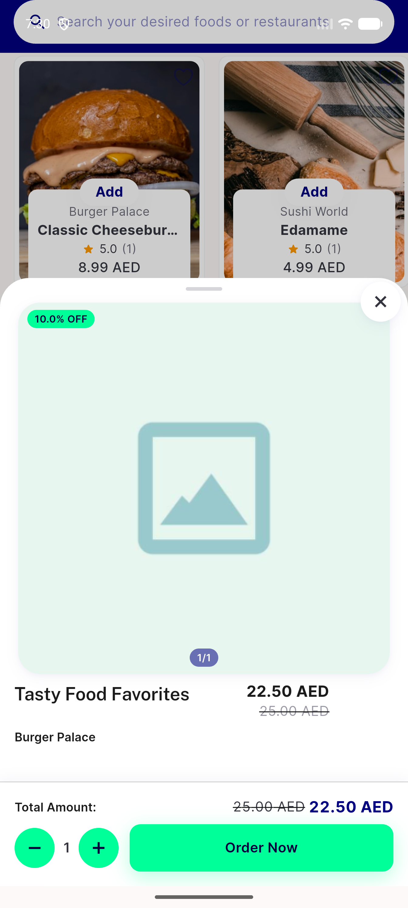

# QA Evidence — NEARS-2487

**QA-lite PASS: item bottom sheet null choice_options fix verified live on emulator-5562 (AC1-3)**

**1 screenshot(s).** Click any thumbnail for full resolution.

<table>
<tr>
<td align="center" width="33%"> ac3 tasty food favorites single price</td>
</tr>
</table>

---
*From `nears/docs/qa-evidence/NEARS-2487/` · public-repo scrub policy (no live secrets; verified clean).*
