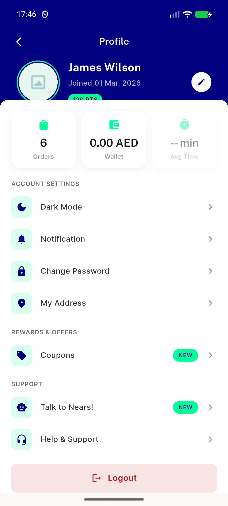

# QA Evidence — NEARS-2491

**PASS — clearSharedData header-reset ordering (NEARS-2491)**

**1 screenshot(s).** Click any thumbnail for full resolution.

<table>
<tr>
<td align="center" width="33%"> ac5 fresh relogin profile</td>
</tr>
</table>

### Other artifacts
- [`logout-and-relogin-net-log.txt`](logout-and-relogin-net-log.txt)
- [`progress.md`](progress.md)

---
*From `nears/docs/qa-evidence/NEARS-2491/` · public-repo scrub policy (no live secrets; verified clean).*
